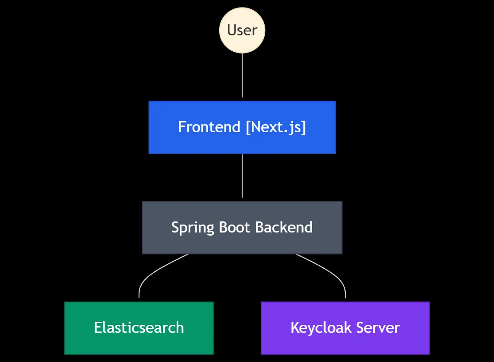
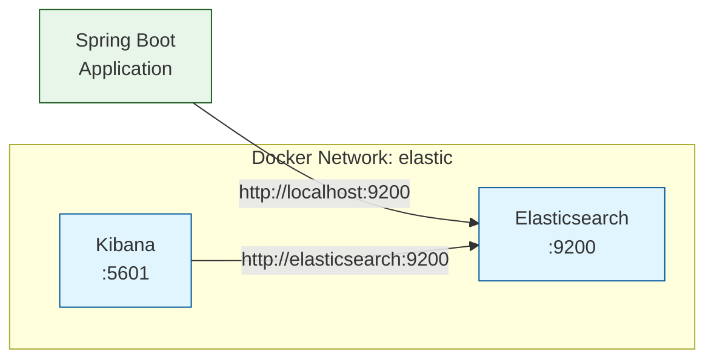

# Restaurant Review Platform

An app to review your restaurant dining experiences. Build with Spring Boot 3 and Elasticsearch.

## Getting Started

### Welcome

Welcome to the Restaurant Review Platform build!

In this project we will implement the Restaurant Review Platform, as defined by the Restaurant Review Platform project brief.

#### Ready?

Let's get started!

### Prerequisites

In the upcoming lessons we’ll be focused on building an application rather than discussing the theory in detail, so a foundational knowledge of certain subjects will help you to get the very most out of this project.

#### Ranking Understanding

As a means of explaining the levels of understanding I suggest for this build, we'll use this simple scale:

1. **Describe** - Recall the basic facts and concepts
2. **Explain** - Explain the ideas or concepts in your own words.
3. **Use** - Use it in new situations without support

With this we can rank each prerequisite so it's clear what level of understanding is recommended.

#### Understanding by Subject

To follow along with this builder, I suggest the following prerequisites:

- Java - Level 3 _Use_
- Maven - Level 3 _Use_
- Spring Boot - Level 3 _Use_
- Spring Security - Level 3 _Use_
- Keycloak - Level 3 _Use_
- Docker - Level 3 _Use_
- Elasticsearch - Level 1 _Describe_
- Node - Level 1 _Describe_

#### Elasticsearch

Although we'll not be diving deep into Elasticsearch in the same we would do in a dedicated course, we will focus on using Elasticsearch in this project.

Therefore a level 1 understanding of Elasticsearch should be enough to start this project aiming for a level 2 understanding by the project's end.

#### Node

A special note about our project’s NextJs frontend. Of course, this project is focused on building a Spring Boot application, however I do provide the same frontend that I use in the lessons.

We’ll be using the Node Package Manager (npm) to install the dependencies for the frontend, so although you don’t need to know how Node works, or how to build a NextJs application, it would be beneficial to know what Node is and what is means to use npm.

Otherwise, a quick read of the Node website should be enough to understand this.

#### Intermediate-level Project

As an intermediate level project the pre-requisite's are more elaborate than beginner-level builders.

If you're unsure about tackling this project, I'd recommend checking out the Task App builder or Blog Platform build before taking this one on!

#### Summary

- Core Java, Maven, Spring Boot and Spring Security require `Use` level understanding
- Docker and Keycloak knowledge should be at `Use` level understanding
- Basic `Describe` level knowledge of Elasticsearch is required
- Node and npm need only `Describe` level understanding for running the frontend
- This is an intermediate project - consider the Task App or Blog Platform if unsure

### Development Environment Setup

Let's now cover setting up your development environment for this project.

#### Java

To build the restaurant review platform you’re going to need Java 21 or later.

You can check your Java version by opening up a terminal or a command prompt and typing:

```shell
java -version
# java version "21.0.5" 2024-10-15 LTS
# Java(TM) SE Runtime Environment (build 21.0.5+9-LTS-239)
# Java HotSpot(TM) 64-Bit Server VM (build 21.0.5+9-LTS-239, mixed mode, sharing)
```

If you see an earlier version then I’d recommend heading over to oracle.com to download JDK 21 or later.

Or if you prefer to use an open source JDK, then you can download it from Adoptium, which is a part of the Eclipse Foundation.

Either JDK should work for this project.

#### Maven

We’ll be using Apache Maven to manage our project, although you’ll not need to install this on your system as an instance of Maven will come bundled with your skeleton Spring Boot project.

#### Node

To run the frontend code I’ll provide, you’ll need Node version 20 or later.

You can check your Node version by opening up a terminal or a command prompt and typing:

```shell
node --version
# v22.13.0
```

Note it’s two dashes before “version” for node, but only one for Java.

If you don’t have the required version then head over to nodejs.org to download a later version of node.

#### Docker

To run the Elasticsearch and Keycloak which we will using later, you’ll need docker installed on your machine.

To check you have docker installed, open up a terminal or command prompt and type:

```shell
docker --version
# Docker version 26.1.1, build 4cf5afa
```

You get a version number printed out, otherwise head over to docker.com to download docker.

#### IDE

I’m going to be using the community version of IntelliJ IDEA as the IDE for this project.

You can use any IDE you like, such as Visual Studio Code, but I recommend IntelliJ as it’s brilliant for Java development.

You can download IntelliJ for free from the JetBrains website.

#### Summary

- You’ll need JDK 21 or later.
- We’ll be using Maven, but you don’t need to install this.
- You’ll need Node V20 or later to run the frontend.
- You’ll need Docker installed to run Elasticsearch and Keycloak.
- You’ll need an IDE, I recommend IntelliJ IDEA.

## What Well Build

### Review Project Brief

Let's examine the project brief for our restaurant review platform to understand what we'll be building.

#### Project Summary

We're building a web-based platform that enables users to:

- Discover local restaurants
- Read authentic reviews from other diners
- Share their own dining experiences through detailed reviews and ratings

The platform will help users make informed decisions about where to eat by providing comprehensive restaurant information and user-generated content.

#### Technical Considerations

From the requirements, we can identify several technical aspects we'll need to implement:

- Geospatial functionality for restaurant location
- Image upload and display
- User authentication
- Review management system
- Sorting and filtering capabilities
- Business logic for review submission and editing

#### Project Focus

This implementation will particularly focus on search functionality through Elasticsearch integration, including:

- Fuzzy search capabilities
- Geospatial search techniques

#### Summary

- Platform enables restaurant discovery and reviews
- Implements core features: search, auth, and image handling
- Focuses on advanced search functionality
- Includes geospatial capabilities
- Provides comprehensive review management

### Domain Overview

Let's analyze the domain objects that will form the foundation of our restaurant review platform.

We'll identify the key entities and their relationships by examining our project requirements.

#### Core Domain Objects

Through analysis of the project brief, we can identify several key domain objects:

##### User

The User object represents registered users of the platform. We're keeping this minimal since authentication will be handled by Keycloak:

- Basic identification (ID, name, email)
- Can create restaurants (as an owner)
- Can write reviews for restaurants

##### Restaurant

The Restaurant entity is central to our platform:

- Core details (name, cuisine type, contact information)
- Average rating (calculated from reviews)
- Contains complex nested objects:
  - Address (including geolocation)
  - Operating hours
  - Photos
  - Reviews

##### Review

Reviews capture user experiences:

- Written content
- Numerical rating (1-5 stars)
- Metadata (author, posting date, last edit date)
- Can include multiple photos
- Editable within 48 hours of posting

##### Supporting Objects

Several supporting objects help organize our domain:

###### Address

- Structured representation of location
- Contains street number, street name, unit, city, state, postal code
- Includes geolocation data (latitude/longitude) for mapping

###### Operating Hours

- Structured as daily time ranges
- Separate open/close times for each day of the week
- Allows for different schedules per day

###### Photo

- URL to stored image
- Additional metadata (caption, upload date)
- Can be associated with restaurants or reviews

#### Domain Relationships

The relationships between these objects create our domain structure:

1. **User-Restaurant**:

   - Users can create restaurants (as owners)
   - One user can create multiple restaurants
   - Each restaurant has one owner

2. **User-Review**:

   - Users write reviews
   - One user can write multiple reviews
   - Each review has one author

3. **Restaurant-Review**:

   - Restaurants contain reviews
   - One restaurant can have multiple reviews
   - Each review belongs to one restaurant

4. **Complex Object Relationships**:

   - Restaurant contains one Address
   - Address contains one GeoLocation
   - Restaurant contains one OperatingHours
   - OperatingHours contains seven TimeRange objects (one per day)
   - Reviews can contain multiple Photos

#### Elasticsearch Considerations

Given our focus on search functionality, our domain model has been influenced by Elasticsearch requirements:

- Restaurant will be a top-level document
- Other objects (Address, Reviews, Photos, etc.) will be nested within these documents
- This structure optimizes for search operations while maintaining relationship integrity

#### Summary

- The `User` can create restaurants and write reviews with basic profile info
- Each `Restaurant` has core details, ratings, photos, and nested structures
- A `Review` includes content, 1-5 star rating, and photos within 48hr edit window
- Supporting objects like `Address` and `OperatingHours` help organize data

### Ui Overview

In this lesson, we'll explore the user interface of our restaurant review platform.

This walkthrough will show you how users will interact with the features we discussed in our project brief and domain overview.

#### Core Screens and Features

The application's interface centers around several key screens that work together to deliver the functionality.

The homepage features a navigation bar with a login button that integrates with Keycloak for authentication.

Below the navigation, restaurant cards display essential information including:

- An image of the restaurant
- The restaurant's name
- A 0-5 star rating
- The type of cuisine served

#### Restaurant Details Page

When users click a restaurant card, they're taken to a detailed view that includes:

- A prominent restaurant image
- An interactive map showing the restaurant's location
- The restaurant's average review rating
- A sortable list of customer reviews
- A "Write Review" button (requires authentication)

The review submission form allows users to:

- Select a star rating
- Write their review content
- Upload photos of their experience
- Submit their review

#### Search and Navigation

The platform includes several ways to find restaurants:

- A search bar for text-based queries
- Cuisine type filtering
- Star rating filters
- Pagination controls for browsing results

Restaurant owners can add new establishments through a dedicated form accessed via the top navigation menu, which includes fields for:

- Restaurant details
- Operating hours
- Location information

#### Summary

- Homepage displays restaurant cards with images, ratings, and cuisine types
- Restaurant details page shows location map, reviews, and submission form
- Search functionality supports search and filtering by rating
- Users can submit reviews with ratings, text, and photos
- Restaurant owners can add new establishments via a dedicated form

### Architecture Overview

Let's explore the architecture of our restaurant review platform, examining how different components work together to create a robust system for restaurant discovery and reviews.

#### System Components

Our architecture consists of four main components:

1. **Frontend (Next.js)**

   - Provides the user interface
   - Handles client-side interactions
   - Communicates with backend via REST API
   - While not the focus of our implementation, code will be provided if you wish to run it

2. **Backend (Spring Boot)**

   - Core of our implementation
   - Processes business logic
   - Manages data flow between frontend and persistence layer
   - Handles authentication and authorization
   - Exposes REST API endpoints

3. **Elasticsearch**

   - Serves as our persistence layer
   - Stores all primary data
   - Provides advanced search capabilities

4. **Keycloak Server**

   - Manages authentication and user management
   - Implements OAuth 2 and OpenID Connect standards
   - Integrates with Spring Security
   - Handles user creation and management

#### Development Environment

Our development environment will utilize Docker to run both Elasticsearch and Keycloak:

- Docker Compose will be used to orchestrate these services
- This approach simplifies the development process
- Allows for consistent environment setup

#### Technical Considerations

While this architecture involves some trade-offs, particularly in using Elasticsearch as our primary data store, it offers several advantages:

- Advanced search capabilities out of the box
- Geospatial search features
- Flexible schema for storing restaurant and review data
- Powerful text analysis for review content

#### Architecture Diagram



#### Summary

- Frontend uses `Next.js` to handle UI and client-side interactions
- Backend uses `Spring Boot` for business logic and API endpoints
- `Elasticsearch` stores data and enables advanced search features
- `Keycloak` manages authentication using OAuth 2 and OpenID Connect

### Rest Api Overview

Let's cover the REST API we are to build!

#### Endpoints

##### Restaurants

**GET /restaurants**
Search for restaurants with filters

- Query Parameters:
  - `q`: Search query string
  - `latitude` & `longitude`: Location coordinates
  - `radius`: Search radius in km
  - `cuisineType`: Filter by cuisine
  - `minRating`: Minimum rating (1-5)
  - `page`: Page number (default: 1)
  - `size`: Results per page (1-100, default: 20)

**POST /restaurants**
Create a new restaurant

- Auth required
- Request: Restaurant details including name, cuisine type, address, location, operating hours

**GET /restaurants/{restaurantId}**
Get detailed information about a specific restaurant

**PUT /restaurants/{restaurantId}**
Update restaurant details

- Auth required

##### Reviews

**GET /restaurants/{restaurantId}/reviews**
Get reviews for a restaurant

- Query Parameters:
  - sort: `date,desc`, `date,asc`, `rating,desc`, `rating,asc` (default: `date,desc`)
  - page: Page number (default: `1`)
  - size: Results per page (`1`-`50`, default: `20`)

**POST /restaurants/{restaurantId}/reviews**
Create a review

- Auth required
- Request: Review content, rating (1-5), optional photo IDs
- Note: Users can only review a restaurant once

**PUT /reviews/{reviewId}**
Update a review

- Auth required
- Restrictions: Can only update within 48 hours of posting
- Request: Updated content, rating, optional photo IDs

##### Photos

**POST /photos**
Upload a photo

- Auth required
- Content-Type: multipart/form-data
- Fields:
  - `file`: Image file
  - `caption`: Optional photo caption

Each paginated response includes metadata with:

- current page number
- page size
- total elements
- total pages

#### Summary

- The REST API allows for managing Restaurants, Reviews and Photos
- The REST API provide a solid base, but may need to be extended during development

## Project Setup

### Create A New Project

Let's begin building our Restaurant Review Platform by creating a new Spring Boot project.

The Spring Initialzr will help us set up a project with all the dependencies we need, saving us time and ensuring we follow best practices from the start.

#### Using Spring Initialzr

Spring Initialzr is a web-based tool that generates Spring Boot projects with your chosen configuration.

Visit [start.spring.io](https://start.spring.io) in your web browser.

On the form, select the following options:

- Project: Maven
- Language: Java
- Spring Boot: 3.4.2
- Packaging: Jar
- Java: 21

For the project metadata, enter:

- Group: com.devtiro
- Artifact: restaurant
- Name: devtiro
- Description: Restaurant Review Platform
- Package name: com.devtiro.restaurant

#### Adding Dependencies

The dependencies we select will add the required libraries to our project.

Click the "ADD DEPENDENCIES" button and add these dependencies:

- Spring Web - For building REST APIs
- Spring Security - For securing our application
- OAuth2 Resource Server - For Keycloak integration
- Spring Data Elasticsearch - For search functionality
- Validation - For input validation
- Lombok - For reducing boilerplate code

#### Generating the Project

Once you've selected all the dependencies, click the "GENERATE" button.

This will download a ZIP file containing your project.

Extract the ZIP file to your preferred workspace location.

#### Summary

- Created a new Spring Boot project using Spring Initialzr
- Selected Java 21, Maven, and Jar packaging format
- Added required dependencies for building a Restaurant Review Platform
- Generated and downloaded the project
- Project is ready for development with all necessary dependencies

### Explore The Project Structure

After creating our project with Spring Initialzr, let's explore the structure and components that make up our Restaurant Review Platform project.

#### Main Project Components

Spring Boot follows a standard project layout that helps keep our code organized and maintainable.

Let's look at the key directories and files in our project:

```text
restaurant/
├── src/
│   ├── main/
│   │   ├── java/
│   │   │   └── com/devtiro/restaurant/
│   │   │       └── RestaurantApplication.java
│   │   └── resources/
│   │       └── application.properties
│   └── test/
│       └── java/
└── pom.xml
```

#### Understanding the POM File

The `pom.xml` file is our project's configuration center, containing all our dependencies and build settings.

Let's examine the dependencies we selected:

```xml
<dependencies>
    <!-- Spring Web for REST endpoints -->
    <dependency>
        <groupId>org.springframework.boot</groupId>
        <artifactId>spring-boot-starter-web</artifactId>
    </dependency>

    <!-- Security and OAuth2 -->
    <dependency>
        <groupId>org.springframework.boot</groupId>
        <artifactId>spring-boot-starter-security</artifactId>
    </dependency>
    <dependency>
        <groupId>org.springframework.boot</groupId>
        <artifactId>spring-boot-starter-oauth2-resource-server</artifactId>
    </dependency>

    <!-- Elasticsearch for search capabilities -->
    <dependency>
        <groupId>org.springframework.boot</groupId>
        <artifactId>spring-boot-starter-data-elasticsearch</artifactId>
    </dependency>

    <!-- Validation for data integrity -->
    <dependency>
        <groupId>org.springframework.boot</groupId>
        <artifactId>spring-boot-starter-validation</artifactId>
    </dependency>

    <!-- Lombok for reducing boilerplate code -->
    <dependency>
        <groupId>org.projectlombok</groupId>
        <artifactId>lombok</artifactId>
    </dependency>
</dependencies>
```

#### Source Code Organization

The `src/main/java` directory contains our application's Java source code.

The main application class `RestaurantReviewApplication.java` serves as the entry point:

```java
@SpringBootApplication
public class RestaurantReviewApplication {
    public static void main(String[] args) {
        SpringApplication.run(RestaurantReviewApplication.class, args);
    }
}
```

The `src/main/resources` directory holds configuration files, with `application.properties` being the primary configuration file where we'll later add settings for Elasticsearch, security, and other components.

The `src/test/java` directory is where we'll place our test classes as we develop the application.

#### Summary

- Project follows standard Spring Boot directory structure
- `pom.xml` contains our selected dependencies for web, security, and search features
- Main application class serves as the entry point
- Resource files are stored in `src/main/resources`

### Running Elasticsearch

In this lesson, we'll set up Elasticsearch and Kibana using Docker Compose, allowing us to add powerful search capabilities to our Restaurant Review Platform.

#### Setting Up Docker Compose

Docker Compose helps us run multiple containers that work together.

Let's create a new file called `docker-compose.yaml` in the root of our project.

Copy the following configuration into your `docker-compose.yaml`:

```yaml
version: '3.8'

services:
  elasticsearch:
    image: docker.elastic.co/elasticsearch/elasticsearch:8.12.0
    container_name: elasticsearch
    environment:
      - node.name=elasticsearch
      - cluster.name=es-docker-cluster
      - discovery.type=single-node
      - bootstrap.memory_lock=true
      - xpack.security.enabled=false
      - 'ES_JAVA_OPTS=-Xms512m -Xmx512m'
    ulimits:
      memlock:
        soft: -1
        hard: -1
    volumes:
      - elasticsearch-data:/usr/share/elasticsearch/data
    ports:
      - '9200:9200'
    networks:
      - elastic

  kibana:
    image: docker.elastic.co/kibana/kibana:8.12.0
    container_name: kibana
    ports:
      - '5601:5601'
    environment:
      - ELASTICSEARCH_HOSTS=http://elasticsearch:9200
    depends_on:
      - elasticsearch
    networks:
      - elastic

volumes:
  elasticsearch-data:
    driver: local

networks:
  elastic:
    driver: bridge
```

#### Starting the Services

To start Elasticsearch and Kibana, open your terminal in the project root directory and run:

```bash
docker-compose up -d
```

The `-d` flag runs the containers in the background.

Wait about a minute for both services to start completely.

#### Configuring Spring Boot

Now we need to tell our Spring Boot application where to find Elasticsearch.

Add the following line to your `application.properties` file:

```properties
spring.elasticsearch.uris=http://localhost:9200
```

#### Verifying the Setup

Let's verify that everything is working correctly:

1. Open your web browser and navigate to `http://localhost:9200`

2. You should see a JSON response with Elasticsearch cluster information.

3. Visit `http://localhost:5601` to access Kibana, which is a helpful tool for managing and visualizing your Elasticsearch data.



#### Summary

- Docker Compose configured to run Elasticsearch and Kibana locally
- Elasticsearch runs on port 9200, Kibana on port 5601
- Application configured to connect to Elasticsearch
- Data persists through container restarts using Docker volumes

### Kibana

Kibana is a powerful web interface for viewing and managing your Elasticsearch data.

In this lesson, we'll learn how to access Kibana and locate our indexes, which will be valuable for monitoring and managing the restaurant data in our application.

#### Accessing Kibana

Kibana typically runs on port 5601 by default.

You can access it by opening your web browser and navigating to `http://localhost:5601`.

When you first visit Kibana, you'll need to log in using your Elasticsearch credentials.

Enter the username `elastic` and the password you set during the Elasticsearch installation.

#### Finding Your Indexes

Once logged in, Kibana presents a dashboard with many features, but we'll focus on finding our indexes.

To view your indexes:

- Click on the hamburger menu (☰) in the top-left corner
- Select "Management" from the menu
- Click on "Stack Management"
- In the left sidebar, under "Data", click on "Index Management"

This section shows all your Elasticsearch indexes, including the ones we'll create for our restaurant reviews.

You can see details like:

- Index name
- Health status
- Number of documents
- Size on disk
- Status (open/closed)

#### Working with Index Management

The Index Management page offers several useful features:

You can filter indexes using the search bar at the top, which helps when you have many indexes.

Each index has actions available through the actions menu (···) including:

- Close/Open index
- Force merge
- Refresh
- Flush
- Clear cache

#### Viewing Index Details

To see more information about an index:

Click on an index name to expand its details.

This shows additional information like:

- Mapping configuration
- Settings
- Statistics
- Status information

This information will be helpful when we start adding our restaurant data and want to verify our index structure.

#### Summary

- Successfully accessed Kibana through the web interface at port 5601
- Located the Index Management section in Stack Management
- Explored available index actions and management features

### Running Keycloak

Now that we have our project set up with Spring Security, we need to add Keycloak to handle user authentication and authorization.

#### Adding Keycloak to Docker Compose

Let's add Keycloak to our existing Docker Compose file that already contains Elasticsearch and Kibana.

Add the following service definition to your `docker-compose.yml` file:

```yaml
keycloak:
  image: quay.io/keycloak/keycloak:23.0
  ports:
    - '9090:8080'
  environment:
    KEYCLOAK_ADMIN: admin
    KEYCLOAK_ADMIN_PASSWORD: admin
    KC_DB: h2-file
  volumes:
    - keycloak-data:/opt/keycloak/data
  command:
    - start-dev
    - --db=dev-file
```

Don't forget to add the volume definition at the bottom of your file:

```yaml
volumes:
  keycloak-data:
    driver: local
```

#### Starting the Services

Now we can start all our services using Docker Compose.

Open a terminal in your project directory and run:

```bash
docker-compose up -d
```

This command starts all services (Elasticsearch, Kibana, and Keycloak) in detached mode.

Wait a few moments for all services to start up.

#### Accessing Keycloak

Once Keycloak is running, you can access its administration console.

Open your web browser and navigate to `http://localhost:9090`.

Click on the "Administration Console" link.

Log in using these credentials:

- Username: `admin`
- Password: `admin`

#### Configuring Spring Boot

Now we need to tell our Spring Boot application where to find Keycloak.

Add this property to your `application.properties` file:

```properties
spring.security.oauth2.resourceserver.jwt.issuer-uri=http://localhost:9090/realms/restaurant-review
```

This property tells Spring Security where to validate JWTs (JSON Web Tokens) that will be used for authentication.

#### Summary

- Added Keycloak service configuration to Docker Compose
- Started all services using Docker Compose
- Accessed Keycloak's administration console at port 9090
- Configured Spring Boot to use Keycloak for JWT validation

### Set Up Mapstruct

In this lesson, we'll integrate Mapstruct with our Restaurant Review Platform to efficiently handle object mapping between different layers of our application, while ensuring it works smoothly with Project Lombok.

#### Understanding Mapstruct and Lombok Integration

Mapstruct is a code generator that helps us create type-safe bean mappings between Java bean classes.

When using Mapstruct alongside Lombok, we need special configuration to ensure both tools work together properly during the compilation process.

The order of annotation processing is important - Lombok must process its annotations before Mapstruct can generate its mapper implementations.

#### Configuring Dependencies

Let's start by adding the required version properties and dependencies to our `pom.xml` file.

First, we'll add the version properties:

```xml
<properties>
    <org.mapstruct.version>1.6.3</org.mapstruct.version>
    <lombok.version>1.18.36</lombok.version>
</properties>
```

We'll need to pin the Lombok version to ensure it works with Mapstruct:

```xml
<dependency>
    <groupId>org.projectlombok</groupId>
    <artifactId>lombok</artifactId>
    <version>${lombok.version}</version>
    <optional>true</optional>
</dependency>
```

Next, we'll add the Mapstruct dependency:

```xml
<dependency>
    <groupId>org.mapstruct</groupId>
    <artifactId>mapstruct</artifactId>
    <version>${org.mapstruct.version}</version>
</dependency>
```

#### Setting up the Maven Compiler Plugin

The Maven Compiler Plugin needs specific configuration to handle both Lombok and Mapstruct annotation processing:

```xml
<plugin>
    <groupId>org.apache.maven.plugins</groupId>
    <artifactId>maven-compiler-plugin</artifactId>
    <configuration>
        <annotationProcessorPaths>
            <!-- Lombok must come first -->
            <path>
                <groupId>org.projectlombok</groupId>
                <artifactId>lombok</artifactId>
                <version>${lombok.version}</version>
            </path>
            <!-- Mapstruct processor -->
            <path>
                <groupId>org.mapstruct</groupId>
                <artifactId>mapstruct-processor</artifactId>
                <version>${org.mapstruct.version}</version>
            </path>
            <!-- Lombok-Mapstruct binding -->
            <path>
                <groupId>org.projectlombok</groupId>
                <artifactId>lombok-mapstruct-binding</artifactId>
                <version>0.2.0</version>
            </path>
        </annotationProcessorPaths>
    </configuration>
</plugin>
```

#### Understanding the Configuration

The `annotationProcessorPaths` section defines the order of annotation processing:

1. Lombok processes its annotations first
2. Mapstruct processes its annotations second
3. The Lombok-Mapstruct binding ensures compatibility between both tools

There's some conflicting information about if the order is required or not, but I found that it is needed.

#### Summary

- Added Mapstruct dependency and version property to the project
- Configured Maven Compiler Plugin for annotation processing
- Set up Lombok-Mapstruct binding for compatibility

### Running The Frontend

The frontend source code is in the `frontend` directory of this repository. Navigate to it in a command prompt or a terminal.

#### Installing Dependencies

To install the dependencies for the project run:

```bash
npm install
```

#### Run the Frontend

To run the frontend, run the following:

```bash
npm run dev
```

This will start the Nextjs development server, with the app available on `http://localhost:3000`.

#### Summary

- Installed the frontend dependencies with `npm install`
- Ran the frontend project with `npm run dev`

## Domain

### Create The User Entity

In this lesson, we'll create a User entity that will store basic user information within our Restaurant Review Platform.

#### Understanding the User Entity Design

While Keycloak will handle user authentication and management, we need a lightweight User entity to store basic user information within our application.

This approach allows us to efficiently access user details when displaying restaurants and reviews, without making additional calls to Keycloak.

However, it's important to note that this creates eventually consistent data - if a user updates their details in Keycloak, our stored information won't automatically update.

#### Creating the User Entity

Let's start by creating a new package to store our entity classes:

```java
package com.devtiro.restaurant.domain.entities;
```

Now, let's create our User class with Lombok annotations to reduce boilerplate code:

```java
@Data               // Generates getters, setters, toString, equals, and hashCode
@AllArgsConstructor // Generates a constructor with all arguments
@NoArgsConstructor  // Generates a no-args constructor
@Builder            // Enables the builder pattern
public class User {
    @Field(type = FieldType.Keyword)
    private String id;

    @Field(type = FieldType.Text)
    private String username;

    @Field(type = FieldType.Text)
    private String givenName;

    @Field(type = FieldType.Text)
    private String familyName;
}
```

#### Understanding the Annotations

The Lombok annotations we're using serve specific purposes:

- `@Data` generates common methods like getters, setters, and `toString`
- `@AllArgsConstructor` and `@NoArgsConstructor` provide constructors we'll need
- `@Builder` enables the creation of User objects using the builder pattern

#### Elasticsearch Field Types

We use two different Elasticsearch field types in our entity:

- `FieldType.Keyword` for the `id` field - this type is used for exact matches and aggregations
- `FieldType.Text` for name fields - this type is better for full-text search and partial matches

#### Summary

- Created a User entity to store basic user information
- Used Lombok annotations to reduce boilerplate code
- Configured `@Field` annotations for Elasticsearch
- Used `FieldType.Keyword` for exact matching of IDs
- Used `FieldType.Text` for searchable name fields

### Create The Address Entity

Restaurants need locations, and to represent these locations in our application, we need an `Address` entity that will store all the necessary address components.

#### Creating the Address Class

Let's start by creating our `Address` class that will hold various components of a physical address.

```java
package com.devtiro.restaurant.domain.entities;

import lombok.AllArgsConstructor;
import lombok.Builder;
import lombok.Data;
import lombok.NoArgsConstructor;
import org.springframework.data.elasticsearch.annotations.Field;
import org.springframework.data.elasticsearch.annotations.FieldType;

@Data
@AllArgsConstructor
@NoArgsConstructor
@Builder
public class Address {
    @Field(type = FieldType.Keyword)
    private String streetNumber;

    @Field(type = FieldType.Text)
    private String streetName;

    @Field(type = FieldType.Keyword)
    private String unit;

    @Field(type = FieldType.Keyword)
    private String city;

    @Field(type = FieldType.Keyword)
    private String state;

    @Field(type = FieldType.Keyword)
    private String postalCode;

    @Field(type = FieldType.Keyword)
    private String country;
}
```

Notice how most fields use `FieldType.Keyword` since they represent exact values that we don't need to analyze or search within.

The exception is `streetName`, which uses `FieldType.Text` because we might want to search within street names.

This approach aligns with how we handled field types in our User entity, where we used `FieldType.Text` for searchable fields and `FieldType.Keyword` for exact matches.

Later, we'll nest this `Address` entity within our `Restaurant` entity to create a complete restaurant record.

#### Summary

- Created the `Address` entity class with Lombok annotations
- Added address-specific fields with appropriate Elasticsearch annotations
- Used `FieldType.Keyword` for exact-match fields like `postalCode`
- Used `FieldType.Text` for searchable fields like `streetName`
- Prepared the entity for nesting in the `Restaurant` entity

### Create The Operatinghours Timerange Entity

In this lesson, we'll build two interconnected entities that will help us manage restaurant opening hours.

#### Understanding the Entity Structure

Restaurant operating hours can be complex, requiring a structured approach to store opening and closing times for each day of the week.

The `TimeRange` entity will represent a single opening period with a start and end time, while `OperatingHours` will contain a `TimeRange` for each day of the week.

#### Creating the TimeRange Entity

Let's start by creating the simpler of the two entities - `TimeRange`:

```java
package com.devtiro.restaurant.domain.entities;

import lombok.AllArgsConstructor;
import lombok.Builder;
import lombok.Data;
import lombok.NoArgsConstructor;
import org.springframework.data.elasticsearch.annotations.Field;
import org.springframework.data.elasticsearch.annotations.FieldType;

@Data
@AllArgsConstructor
@NoArgsConstructor
@Builder
public class TimeRange {
    @Field(type = FieldType.Keyword)
    private String openTime;  // Stores opening time (e.g., "09:00")

    @Field(type = FieldType.Keyword)
    private String closeTime; // Stores closing time (e.g., "17:00")
}
```

We use `FieldType.Keyword` here because times should be matched exactly, not analyzed for text search.

#### Creating the OperatingHours Entity

Now we'll create the `OperatingHours` entity which will contain a `TimeRange` for each day:

```java
package com.devtiro.restaurant.domain.entities;

import lombok.AllArgsConstructor;
import lombok.Builder;
import lombok.Data;
import lombok.NoArgsConstructor;
import org.springframework.data.elasticsearch.annotations.Field;
import org.springframework.data.elasticsearch.annotations.FieldType;

@Data
@AllArgsConstructor
@NoArgsConstructor
@Builder
public class OperatingHours {
    @Field(type = FieldType.Nested)
    private TimeRange monday;    // TimeRange for Monday

    @Field(type = FieldType.Nested)
    private TimeRange tuesday;   // TimeRange for Tuesday

    @Field(type = FieldType.Nested)
    private TimeRange wednesday; // TimeRange for Wednesday

    @Field(type = FieldType.Nested)
    private TimeRange thursday;  // TimeRange for Thursday

    @Field(type = FieldType.Nested)
    private TimeRange friday;    // TimeRange for Friday

    @Field(type = FieldType.Nested)
    private TimeRange saturday;  // TimeRange for Saturday

    @Field(type = FieldType.Nested)
    private TimeRange sunday;    // TimeRange for Sunday
}
```

The `FieldType.Nested` annotation is particularly important here.

It tells Elasticsearch to treat each `TimeRange` as a nested object, maintaining the relationship between opening and closing times.

This allows us to query operating hours as complete units rather than independent fields.

#### Summary

- Created the `TimeRange` entity to store opening and closing times
- Built the `OperatingHours` entity containing nested `TimeRange` objects
- Used `FieldType.Nested` to maintain relationships between fields
- Prepared both entities for integration with the `Restaurant` entity

### Create The Photo Entity

In our restaurant review platform, we need a way to store and manage photos that users can attach to their restaurant listings and reviews.

#### Creating the Photo Entity

Let's build our `Photo` entity which will store information about uploaded images in our application.

This entity will be designed to be nested within both `Restaurant` and `Review` entities, making it flexible for various use cases.

Here's how we'll implement the `Photo` entity:

```java
package com.devtiro.restaurant.domain.entities;

import lombok.AllArgsConstructor;
import lombok.Builder;
import lombok.Data;
import lombok.NoArgsConstructor;
import org.springframework.data.elasticsearch.annotations.DateFormat;
import org.springframework.data.elasticsearch.annotations.Field;
import org.springframework.data.elasticsearch.annotations.FieldType;

import java.time.LocalDateTime;

@Data
@AllArgsConstructor
@NoArgsConstructor
@Builder
public class Photo {

    @Field(type = FieldType.Keyword)
    private String url;

    @Field(type = FieldType.Date, format = DateFormat.date_hour_minute_second)
    private LocalDateTime uploadDate;
}
```

#### Field Configurations

The `Photo` entity contains two main fields that serve distinct purposes.

The `url` field uses `FieldType.Keyword` since we want exact matches when searching for specific photo URLs in our system.

For the `uploadDate` field, we use `FieldType.Date` with a specific format of `DateFormat.date_hour_minute_second` to ensure proper storage and retrieval of the upload timestamp.

#### Date Format Specification

When working with `LocalDateTime` in Elasticsearch, specifying the date format is particularly important.

The `DateFormat.date_hour_minute_second` format allows us to store and query both the date and time components with precision up to the second.

This level of detail is useful for tracking when photos were uploaded and ordering them chronologically.

#### Summary

- Created the `Photo` entity with `url` and `uploadDate` fields
- Used `FieldType.Keyword` for the `url` field for exact matching
- Configured `LocalDateTime` with proper date format
- Prepared entity for nesting in `Restaurant` and `Review` entities

### Create The Review Entity

Reviews are a key component of our restaurant platform, allowing users to share their experiences and ratings.

In this lesson, we'll create the `Review` entity that will store review content, ratings, and related data.

#### Understanding the Review Structure

The `Review` entity will contain several important pieces of information:

- The review content and rating
- Who wrote the review
- When it was posted and last edited
- Any photos attached to the review

Let's create our `Review` class with all these components.

#### Creating the Review Entity

Let's create our `Review` class in the `com.devtiro.restaurant.domain.entities` package:

```java
package com.devtiro.restaurant.domain.entities;

import lombok.*;
import org.springframework.data.elasticsearch.annotations.DateFormat;
import org.springframework.data.elasticsearch.annotations.Field;
import org.springframework.data.elasticsearch.annotations.FieldType;

import java.time.LocalDateTime;
import java.util.ArrayList;
import java.util.List;

@Data
@AllArgsConstructor
@NoArgsConstructor
@Builder
public class Review {

    @Field(type = FieldType.Keyword)
    private String id;

    @Field(type = FieldType.Text)
    private String content;

    @Field(type = FieldType.Integer)
    private Integer rating;

    @Field(type = FieldType.Date, format = DateFormat.date_hour_minute_second)
    private LocalDateTime datePosted;

    @Field(type = FieldType.Date, format = DateFormat.date_hour_minute_second)
    private LocalDateTime lastEdited;

    @Field(type = FieldType.Nested)
    private List<Photo> photos = new ArrayList<>();

    @Field(type = FieldType.Nested)
    private User writtenBy;
}
```

#### Understanding the Fields

The `rating` field uses `FieldType.Integer`, which is new to our application.

This field type is perfect for numeric values that we want to use in calculations, like computing average ratings.

For our date fields, we use the `DateFormat.date_hour_minute_second` format to capture precise timestamps of when reviews are posted and edited.

The `photos` field is initialized with an empty `ArrayList` to ensure we never have a null list, making it safer to work with.

#### Summary

- Created the `Review` entity with content and rating fields
- Added timestamp fields with proper `DateFormat` configuration
- Used `FieldType.Integer` for the `rating` field
- Included nested `Photo` and `User` relationships
- Initialized the `photos` list for safe handling

### Create The Restaurant Entity

Now that we have created all our supporting entities, we'll bring them together to create the main `Restaurant` entity, which will serve as the central model for our restaurant review platform.

#### Creating the Restaurant Class

The `Restaurant` entity ties together all the components we need to represent a restaurant in our system.

Let's create a new class in the `com.devtiro.restaurant.domain.entities` package:

```java
package com.devtiro.restaurant.domain.entities;

import lombok.AllArgsConstructor;
import lombok.Builder;
import lombok.Data;
import lombok.NoArgsConstructor;
import org.springframework.data.annotation.Id;
import org.springframework.data.elasticsearch.annotations.Document;
import org.springframework.data.elasticsearch.annotations.Field;
import org.springframework.data.elasticsearch.annotations.FieldType;
import org.springframework.data.elasticsearch.annotations.GeoPointField;
import org.springframework.data.elasticsearch.core.geo.GeoPoint;

import java.util.ArrayList;
import java.util.List;

@Document(indexName = "restaurants")
@Data
@AllArgsConstructor
@NoArgsConstructor
@Builder
public class Restaurant {
    // Class implementation will go here
}
```

#### Defining the Document and Fields

The `@Document` annotation marks this class as an Elasticsearch document and specifies the index name as "restaurants".

Let's add our fields:

```java
    @Id
    private String id;

    @Field(type = FieldType.Text)
    private String name;

    @Field(type = FieldType.Text)
    private String cuisineType;

    @Field(type = FieldType.Keyword)
    private String contactInformation;

    @Field(type = FieldType.Float)
    private Float averageRating;

    @GeoPointField
    private GeoPoint geoLocation;
```

The `geoLocation` field uses the `@GeoPointField` annotation to store the restaurant's location as a point on a map.

#### Adding Nested Relationships

We'll now integrate the entities we created in previous lessons:

```java
    @Field(type = FieldType.Nested)
    private Address address;

    @Field(type = FieldType.Nested)
    private OperatingHours operatingHours;

    @Field(type = FieldType.Nested)
    private List<Photo> photos = new ArrayList<>();

    @Field(type = FieldType.Nested)
    private List<Review> reviews = new ArrayList<>();

    @Field(type = FieldType.Nested)
    private User createdBy;
```

We use `FieldType.Nested` to maintain the relationship structure between the `Restaurant` and its related entities.

The `photos` and `reviews` lists are initialized with empty `ArrayList` objects to prevent null pointer exceptions.

#### Summary

- Created the `Restaurant` entity with `@Document` configuration for Elasticsearch
- Added basic fields including `name`, `cuisineType`, and `contactInformation`
- Integrated `@GeoPointField` for storing restaurant location data
- Added nested relationships to `Address`, `OperatingHours`, `Photo`, `Review`, and `User`

### Create Restaurant Repository

Now that we have our `Restaurant` entity and all its related entities set up, we need a way to store and retrieve restaurant data from Elasticsearch.
We'll create a repository interface that gives us the basic operations we need to work with restaurant data.

#### Implementing the Restaurant Repository

The repository interface will serve as our gateway to perform operations on restaurant data in Elasticsearch.
Here's how we'll implement it:

```java
package com.restaurant.review.repository;

import com.restaurant.review.entity.Restaurant;
import org.springframework.data.elasticsearch.repository.ElasticsearchRepository;
import org.springframework.stereotype.Repository;

@Repository
public interface RestaurantRepository extends ElasticsearchRepository<Restaurant, String> {
    // Custom queries will be added in future lessons
}
```

The `@Repository` annotation marks this interface as a Spring Data repository bean.
This tells Spring to create an implementation of this interface at runtime.

Even though our repository looks simple now, it already provides many useful operations inherited from `ElasticsearchRepository`:

- `save()` - Saves a restaurant or updates it if it already exists
- `findById()` - Finds a restaurant by its ID
- `findAll()` - Retrieves all restaurants
- `delete()` - Removes a restaurant
- `count()` - Returns the total number of restaurants

In future lessons, we'll expand this repository by adding custom queries for searching restaurants by name, location, cuisine type, and other criteria.

#### Summary

- Created the `RestaurantRepository` interface extending `ElasticsearchRepository`
- Added `@Repository` annotation for Spring configuration
- Gained access to basic CRUD operations through inheritance
- Set up foundation for future custom query methods

## Authentication

### Creating Users

In this lesson, we'll set up our first user in Keycloak, which we'll use later to test our authentication system for the restaurant review platform.

#### Setting Up Keycloak Realm

Before we can create users, we need to set up a dedicated realm in Keycloak for our application.

A realm in Keycloak is like a separate universe for your application's users and security settings.

If you haven't already, here's how to create a new realm:

1. Log into the Keycloak Admin Console using your administrator credentials.

2. Click on the dropdown in the top-left corner that says "master".

3. Click "Create Realm".

4. Enter "restaurant-review" as the realm name.

5. Click "Create".

#### Creating Your First User

Now that we have our realm set up, let's create a test user.

Follow these steps to create a user:

1. In the left sidebar, click on "Users".

2. Click the "Add user" button.

3. Fill in the following details:

```text
Username: testuser
Email: testuser@example.com
First Name: Test
Last Name: User
```

4. Make sure "Email Verified" is switched ON.

5. Click "Create".

#### Setting User Credentials

For development purposes, we'll set a simple password for our test user.

Here's how to set the password:

1. After creating the user, go to the "Credentials" tab.

2. Click "Set password".

3. Enter these details:

```text
Password: password
Password Confirmation: password
```

4. Switch "Temporary" to OFF so the user won't need to change their password on first login.

5. Click "Save".

#### Development Considerations

Setting passwords manually like this is convenient during development, but it's not recommended for production environments.

In production, you should:

- Use strong password policies
- Enable email verification
- Implement password reset flows
- Consider enabling two-factor authentication

These security measures help protect your users and their data.

#### Summary

- Added a new user `testuser` with basic profile information
- Set up user credentials with password `password`

### Create Security Config

Now that we have set up our users in Keycloak, we need to configure Spring Security in our application to protect our endpoints and validate access tokens.

#### Setting Up the Configuration Class

First, let's create a dedicated package for our configuration classes to keep our code organized.

Create a new package called `com.devtiro.restaurant.config`.

In this package, we'll create our `SecurityConfig` class which will manage our application's security settings.

```java
package com.devtiro.restaurant.config;

import org.springframework.context.annotation.Bean;
import org.springframework.context.annotation.Configuration;
import org.springframework.security.config.annotation.web.builders.HttpSecurity;
import org.springframework.security.config.annotation.web.configuration.EnableWebSecurity;
import org.springframework.security.config.http.SessionCreationPolicy;
import org.springframework.security.oauth2.server.resource.authentication.JwtAuthenticationConverter;
import org.springframework.security.web.SecurityFilterChain;

@EnableWebSecurity
@Configuration
public class SecurityConfig {

    @Bean
    public SecurityFilterChain filterChain(HttpSecurity http) throws Exception {
        http
                .authorizeHttpRequests(auth -> auth
                        .anyRequest().authenticated()
                )
                .oauth2ResourceServer(oauth2 ->
                        oauth2.jwt(jwt ->
                                jwt.jwtAuthenticationConverter(jwtAuthenticationConverter())))
                .sessionManagement(session ->
                        session.sessionCreationPolicy(SessionCreationPolicy.STATELESS)
                )
                .csrf(csrf -> csrf.disable())
        ;
        return http.build();
    }

    @Bean
    public JwtAuthenticationConverter jwtAuthenticationConverter() {
        return new JwtAuthenticationConverter();
    }
}
```

#### Understanding the Configuration

This configuration sets up several key security features for our application.

The `@EnableWebSecurity` annotation enables Spring Security's web security support.

We configure all endpoints to require authentication with `.anyRequest().authenticated()`.

Since we're building a REST API, we set the session creation policy to `STATELESS`, meaning no sessions will be created or used.

We've disabled CSRF protection as we're building a stateless REST API, though in production applications you might want to enable it for additional security.

The configuration works with the `spring.security.oauth2.resourceserver.jwt.issuer-uri` property we set earlier, which tells Spring Security where to validate JWT tokens.

#### Summary

- Created `SecurityConfig` class to manage application security settings
- Configured application to require authentication for all endpoints
- Set up stateless session management for our REST API
- Enabled JWT token validation with Keycloak

## Photo Upload

### File Storage Design

In our restaurant review platform, users need to upload photos of their dining experiences.

Let's design a simple yet effective way to handle file storage that will serve as the foundation for our photo upload feature.

#### Understanding File Storage Options

When building web applications that handle file uploads, you have multiple storage options available.

The most straightforward approach is saving files directly to the server's disk.

While cloud storage services like AWS S3 or Azure Blob Storage are popular choices, we'll start with local disk storage to keep our implementation focused and manageable.

#### Designing the Storage Service

The storage service needs to handle two primary operations: storing uploaded files and retrieving them when needed.

Let's create a service interface that defines these operations:

```java
package com.devtiro.restaurant.services;

import org.springframework.core.io.Resource;
import org.springframework.web.multipart.MultipartFile;

import java.util.Optional;

public interface StorageService {
    // Store a file and return its unique identifier
    String store(MultipartFile file, String filename);

    // Retrieve a file by its identifier
    Optional<Resource> loadAsResource(String filename);
}
```

Let's break down the interface methods:

- The `store` method accepts a `MultipartFile` (Spring's representation of an uploaded file) and a filename, returning a String identifier
- The `loadAsResource` method takes a filename and returns an `Optional<Resource>`, allowing for cases where the file might not exist

#### Summary

- Created `StorageService` interface for managing file operations
- Defined methods for storing and retrieving files from disk

### Custom Exceptions

In our restaurant review platform, we need a way to handle errors that are specific to our application's needs.

#### Understanding Custom Exceptions

Custom exceptions help us communicate domain-specific errors in our application, going beyond the generic exceptions provided by Java.

They allow us to add meaning to our error handling, making it clear what went wrong in the context of our application.

In our case, we want to create exceptions that clearly indicate when something goes wrong with our file storage operations.

#### Creating a Base Exception

Let's start by creating a base exception that will serve as the parent for all our custom exceptions.

First, create a new package called `com.devtiro.restaurant.exceptions`.

Here's our base exception class:

```java
package com.devtiro.restaurant.exceptions;

public class BaseException extends RuntimeException {
    public BaseException() {
        super();
    }

    public BaseException(String message) {
        super(message);
    }

    public BaseException(String message, Throwable cause) {
        super(message, cause);
    }
}
```

Notice that we extend `RuntimeException` rather than `Exception`.

This choice follows clean code principles, as checked exceptions can break the open/closed principle by forcing changes across multiple layers when new error conditions are added.

#### Creating the Storage Exception

Building on our base exception, we'll create a specific exception for file storage operations:

```java
package com.devtiro.restaurant.exceptions;

public class StorageException extends BaseException {
    public StorageException() {
        super();
    }

    public StorageException(String message) {
        super(message);
    }

    public StorageException(String message, Throwable cause) {
        super(message, cause);
    }
}
```

This exception will be used in our `StorageService` when operations like saving or retrieving files fail.

We can now throw this exception with meaningful messages that relate specifically to storage operations:

```java
if (!file.exists()) {
    throw new StorageException("File not found: " + filename);
}
```

#### Summary

- Created a hierarchy of custom exceptions for our application
- `BaseException` serves as the parent for all custom exceptions
- `StorageException` extends `BaseException` for file operations
- Used `RuntimeException` to avoid checked exception constraints

### Storing Files

Building on our previous work with the `StorageService` interface, we'll now create a concrete implementation that stores files on disk for our restaurant review platform.

#### Creating the Service Implementation

The implementation of file storage requires a dedicated service class to handle the file operations effectively.

First, let's create a new package `com.devtiro.restaurant.services.impl` to house our service implementations.

Within this package, we'll create the `FileSystemStorageService` class that implements our `StorageService` interface:

```java
@Service
@Slf4j
public class FileSystemStorageService implements StorageService {
    @Value("${app.storage.location:uploads}")
    private String storageLocation;

    private Path rootLocation;
}
```

The `@Value` annotation lets us configure the storage location through application properties, with a default value of "uploads" if not specified.

#### Initializing Storage Location

Before we can store files, we need to ensure our storage directory exists.

We'll use the `@PostConstruct` annotation to initialize our storage location after the bean is created:

```java
@PostConstruct
public void init() {
    rootLocation = Paths.get(storageLocation);
    try {
        Files.createDirectories(rootLocation);
    } catch (IOException e) {
        throw new StorageException("Could not initialize storage location", e);
    }
}
```

We use `@PostConstruct` instead of the constructor because we need to ensure all properties are injected before initialization.

#### Implementing File Storage

The `store` method handles the actual file storage operation:

```java
@Override
public String store(MultipartFile file, String filename) {
    try {
        // Check for empty files
        if (file.isEmpty()) {
            throw new StorageException("Failed to store empty file");
        }

        // Create final filename with extension
        String extension = StringUtils.getFilenameExtension(file.getOriginalFilename());
        String finalFilename = filename + "." + extension;

        // Resolve and normalize the destination path
        Path destinationFile = this.rootLocation.resolve(Paths.get(finalFilename))
                .normalize().toAbsolutePath();

        // Security check to prevent directory traversal
        if (!destinationFile.getParent().equals(this.rootLocation.toAbsolutePath())) {
            throw new StorageException("Cannot store file outside current directory");
        }

        // Copy the file to the destination
        try (InputStream inputStream = file.getInputStream()) {
            Files.copy(inputStream, destinationFile, StandardCopyOption.REPLACE_EXISTING);
        }

        return finalFilename;
    } catch (IOException e) {
        throw new StorageException("Failed to store file", e);
    }
}
```

This implementation includes several safety checks and uses our previously created `StorageException` for error handling.

#### Security and Management Considerations

While our implementation focuses on basic functionality, there are several important considerations for production environments:

- Files should be scanned for malware before storage
- File sizes should be limited to prevent disk space issues
- File types should be validated to prevent security vulnerabilities
- Proper file permissions should be set to protect stored data

#### Summary

- Implemented `FileSystemStorageService` to store files on disk
- Used `@Value` annotation to configure storage location path
- Initialized storage directory with `@PostConstruct`
- Implemented secure file storage with path validation
- Added error handling using `StorageException`

### Retrieving Files

Now that we can store files on disk, we need to implement the functionality to retrieve them.
This will complete our `StorageService` implementation by adding the `loadAsResource` method.

#### Understanding Spring Resources

Spring's `Resource` abstraction provides a unified way to handle different types of resources, including files.

The `Resource` interface offers methods to check if a resource exists and to read its contents.

For file system resources, we use Spring's `UrlResource` class, which handles files through URLs and file paths.

#### Implementing File Retrieval

Let's implement the `loadAsResource` method in our `FileSystemStorageService` class:

```java
@Override
public Optional<Resource> loadAsResource(String filename) {
    try {
        // Resolve the file path relative to our root location
        Path file = rootLocation.resolve(filename);

        // Create a Resource object from the file path
        Resource resource = new UrlResource(file.toUri());

        // Check if the resource exists and is readable
        if (resource.exists() || resource.isReadable()) {
            return Optional.of(resource);
        } else {
            return Optional.empty();
        }
    } catch (MalformedURLException e) {
        log.debug("Could not read file: " + filename, e);
        return Optional.empty();
    }
}
```

The method follows these steps:

- Converts the filename to a full file path using `resolve`
- Creates a `UrlResource` from the file path
- Checks if the file exists and is readable
- Returns the resource wrapped in an `Optional`

#### Error Handling

We use `Optional` to handle cases where the file might not exist.

This approach is better than throwing exceptions for missing files, as a missing file is a valid scenario rather than an error condition.

The method catches `MalformedURLException` and returns an empty `Optional` instead of throwing an exception.

This makes the API more user-friendly as clients can easily check if a file exists using `Optional`'s methods.

#### Summary

- Implemented `loadAsResource` method to retrieve stored files
- Used Spring's `Resource` interface for file handling
- Implemented error handling with `Optional`
- Used `UrlResource` to represent file system resources
- Added logging for debugging file access issues

### Uploading Retrieving Photos

Building on our previous work with the `StorageService`, we'll now create a dedicated service for handling photo operations, which will generate unique identifiers for photos and maintain additional metadata about uploaded images.

#### The Photo Service Interface

Let's start by defining a clear contract for photo operations through an interface.

```java
package com.devtiro.restaurant.services;

import com.devtiro.restaurant.domain.entities.Photo;
import org.springframework.core.io.Resource;
import org.springframework.web.multipart.MultipartFile;

import java.util.Optional;

public interface PhotoService {
    Photo uploadPhoto(MultipartFile file);
    Optional<Resource> getPhotoAsResource(String id);
}
```

The interface defines two main operations: uploading a new photo and retrieving an existing one.

The `uploadPhoto` method returns a `Photo` entity that contains metadata about the uploaded file.

The `getPhotoAsResource` method returns an `Optional<Resource>` to handle cases where the photo might not exist.

#### Implementing the Photo Service

Now let's implement the photo service, leveraging our existing `StorageService`.

```java
@Service
@RequiredArgsConstructor
public class PhotoServiceImpl implements PhotoService {

    private final StorageService storageService;

    @Override
    public Photo uploadPhoto(MultipartFile file) {
        // Generate a unique ID for the photo
        String photoId = UUID.randomUUID().toString();

        // Store the file and get its URL
        String url = storageService.store(file, photoId);

        // Create and populate the photo entity
        Photo photo = new Photo();
        photo.setUrl(url);
        photo.setUploadDate(LocalDateTime.now());

        return photo;
    }

    @Override
    public Optional<Resource> getPhotoAsResource(String id) {
        return storageService.loadAsResource(id);
    }
}
```

The implementation delegates the actual file operations to the `StorageService` we created earlier.

For photo uploads, we generate a unique identifier using `UUID` to ensure no two photos have the same ID.

We store additional metadata like the upload date, which will be useful for tracking and managing photos.

#### Summary

- Implemented `PhotoService` interface defining upload and retrieval operations
- Created `PhotoServiceImpl` to manage photo storage and retrieval
- Used `UUID` to generate unique identifiers for photos
- Leveraged existing `StorageService` for file operations

### Photo Dto Mapper

Now that we have our photo service implementation ready, we need to create a Data Transfer Object (DTO) to represent photos in our REST API responses.

#### Understanding DTOs

A DTO is a simple object that carries data between processes, helping us separate our internal data model from what we expose to API consumers.

In our case, we want to expose only the photo URL and upload date, keeping internal details like file paths private.

#### Creating the Photo DTO

Let's start by creating a new package `com.devtiro.restaurant.domain.dtos` and implementing our `PhotoDto` class:

```java
package com.devtiro.restaurant.domain.dtos;

import lombok.AllArgsConstructor;
import lombok.Builder;
import lombok.Data;
import lombok.NoArgsConstructor;

import java.time.LocalDateTime;

@Data
@NoArgsConstructor
@AllArgsConstructor
@Builder
public class PhotoDto {
    private String url;
    private LocalDateTime uploadDate;
}
```

The `@Data` annotation from Lombok generates getters, setters, equals, hashCode, and toString methods.

The `@Builder` annotation enables the builder pattern for creating instances of our DTO.

#### Implementing the Photo Mapper

To convert between our `Photo` entity and `PhotoDto`, we'll use MapStruct, a code generation tool that makes mapping between Java beans simple.

Create a new package `com.devtiro.restaurant.mappers` and add the `PhotoMapper` interface:

```java
package com.devtiro.restaurant.mappers;

import com.devtiro.restaurant.domain.dtos.PhotoDto;
import com.devtiro.restaurant.domain.entities.Photo;
import org.mapstruct.Mapper;
import org.mapstruct.ReportingPolicy;

@Mapper(componentModel = "spring", unmappedTargetPolicy = ReportingPolicy.IGNORE)
public interface PhotoMapper {
    PhotoDto toDto(Photo photo);
}
```

The `@Mapper` annotation tells MapStruct to generate the implementation.

The `componentModel = "spring"` parameter makes the mapper available for dependency injection.

The `unmappedTargetPolicy = ReportingPolicy.IGNORE` setting tells MapStruct to ignore any fields that don't have a matching property in the target object.

#### Summary

- Created `PhotoDto` to represent photos in API responses
- Used Lombok annotations to reduce boilerplate code in the DTO
- Implemented `PhotoMapper` interface using MapStruct
- Set up automatic mapping between `Photo` and `PhotoDto`

### Photo Upload Endpoint

In this lesson, we'll create a REST API endpoint that allows users to upload photos to our restaurant review platform.

We'll build on our existing photo services and create a controller that handles the upload process through a simple HTTP request.

#### Creating the Controller

Controllers in Spring Boot handle incoming HTTP requests and direct them to the appropriate service layers.

Let's create a new package `com.devtiro.restaurant.controllers` and add our `PhotoController` class:

```java
@RequiredArgsConstructor
@RestController
@RequestMapping("/api/photos")
public class PhotoController {

    private final PhotoService photoService;
    private final PhotoMapper photoMapper;

    @PostMapping
    public PhotoDto uploadPhoto(
            @RequestParam("file") MultipartFile file) {
        Photo savedPhoto = photoService.uploadPhoto(file);
        return photoMapper.toDto(savedPhoto);
    }
}
```

Let's break down the key components of our controller:

- The `@RestController` annotation tells Spring this class handles REST requests
- `@RequestMapping("/api/photos")` sets the base URL path for all endpoints in this controller
- `@RequiredArgsConstructor` automatically creates a constructor for our final fields
- The `uploadPhoto` method is mapped to POST requests using `@PostMapping`
- `@RequestParam("file")` binds the uploaded file to the `MultipartFile` parameter

#### Understanding MultipartFile

Spring's `MultipartFile` interface represents an uploaded file in a multipart request.

It provides methods to:

- Access the original filename
- Get the file's content type
- Read the file's contents
- Get the file size

The interface works seamlessly with our existing `PhotoService` which we implemented in previous lessons.

#### Testing the Endpoint

Once you've implemented the controller, you can test it using any HTTP client that supports file uploads.

Here's what happens when you make a request:

1. The client sends a POST request to `/api/photos` with the file in the request body
2. Our controller receives the file and passes it to the `PhotoService`
3. The `PhotoService` generates a UUID and stores the file
4. The file is saved to disk using our `StorageService`
5. A `PhotoDto` containing the UUID and metadata is returned to the client

#### Summary

- Created `PhotoController` to handle REST API requests
- Implemented the `/api/photos` endpoint for photo uploads
- Used Spring's `MultipartFile` for file handling
- Connected the controller to our `PhotoService`
- Returns a `PhotoDto` with the photo's UUID and metadata

### Error Handling

When building REST APIs, proper error handling ensures users receive clear, consistent responses when things go wrong.

#### Creating the Error DTO

To standardize our error responses, we'll create an `ErrorDto` class that defines the structure of error messages sent to API clients.

The `ErrorDto` class uses Lombok annotations to reduce boilerplate code and includes two fields: `status` for the HTTP status code and `message` for the error description.

```java
@Data
@AllArgsConstructor
@NoArgsConstructor
@Builder
public class ErrorDto {
    private Integer status;
    private String message;
}
```

#### Implementing Global Error Handling

Spring's `@ControllerAdvice` annotation allows us to handle exceptions across our entire application in one place.

We'll create an `ErrorController` class that catches and processes different types of exceptions:

```java
@RestController
@ControllerAdvice
@Slf4j
public class ErrorController {

    // Handle storage-related exceptions
    @ExceptionHandler(StorageException.class)
    public ResponseEntity<ErrorDto> handleStorageException(StorageException ex) {
        log.error("Caught StorageException exception", ex);

        ErrorDto error = ErrorDto.builder()
                .status(HttpStatus.INTERNAL_SERVER_ERROR.value())
                .message("Unable to save or recall the resource at this time")
                .build();

        return new ResponseEntity<>(error, HttpStatus.INTERNAL_SERVER_ERROR);
    }

    // Handle our base application exception
    @ExceptionHandler(BaseException.class)
    public ResponseEntity<ErrorDto> handleBaseException(BaseException ex) {
        log.error("Caught BaseException", ex);

        ErrorDto error = ErrorDto.builder()
                .status(HttpStatus.INTERNAL_SERVER_ERROR.value())
                .message("An unexpected error occurred")
                .build();

        return new ResponseEntity<>(error, HttpStatus.INTERNAL_SERVER_ERROR);
    }

    // Catch-all for unexpected exceptions
    @ExceptionHandler(Exception.class)
    public ResponseEntity<ErrorDto> handleException(Exception ex) {
        log.error("Caught unexpected exception", ex);

        ErrorDto error = ErrorDto.builder()
                .status(HttpStatus.INTERNAL_SERVER_ERROR.value())
                .message("An unexpected error occurred")
                .build();

        return new ResponseEntity<>(error, HttpStatus.INTERNAL_SERVER_ERROR);
    }
}
```

This implementation builds on our custom exceptions from previous lessons, particularly the `StorageException` we created for file operations.

Each handler method logs the error and returns an appropriate error response.

#### Summary

- Created `ErrorDto` to standardize API error responses
- Implemented global error handling with `@ControllerAdvice`
- Added specific handlers for `StorageException` and `BaseException`
- Included logging for debugging and monitoring
- Used `ResponseEntity` to control HTTP status codes

### Photo Retrieval Endpoint

Now that we can upload photos, we need to implement the endpoint that allows users to retrieve them.

This is particularly important as we want to display restaurant photos to users before they log in, making using the site more engaging.

#### Implementing the Photo Retrieval Endpoint

The photo retrieval endpoint needs to return the actual photo file along with the correct content type, so browsers can display it properly.

Let's add the retrieval endpoint to our existing `PhotoController`:

```java
@GetMapping("/{id:.+}")
public ResponseEntity<Resource> getPhoto(@PathVariable String id) {
    return photoService.getPhotoAsResource(id).map(photo ->
            ResponseEntity.ok()
                    .contentType(MediaTypeFactory
                            .getMediaType(photo)
                            .orElse(MediaType.APPLICATION_OCTET_STREAM))
                    .header(HttpHeaders.CONTENT_DISPOSITION, "inline")
                    .body(photo)
    ).orElse(ResponseEntity.notFound().build());
}
```

Let's break down the key components of this endpoint:

- The `{id:.+}` path variable pattern allows for file extensions in the ID
- We use `ResponseEntity` to control the HTTP response details
- `MediaTypeFactory` helps determine the correct content type for the photo
- The `Content-Disposition: inline` header tells browsers to display the image rather than download it

#### Updating Security Configuration

To allow unauthenticated access to photos, we need to update our security configuration:

```java
@Bean
public SecurityFilterChain filterChain(HttpSecurity http) throws Exception {
    http
            .authorizeHttpRequests(auth -> auth
                    // Allow for loading of photos
                    .requestMatchers(HttpMethod.GET, "/api/photos/**").permitAll()
                    .anyRequest().authenticated()
            )
            // ... rest of the security configuration
    return http.build();
}
```

This configuration specifically allows GET requests to `/api/photos/**` without authentication, while maintaining security for other endpoints.

#### Testing the Endpoint

You can test the endpoint by:

1. First uploading a photo and noting the returned ID
2. Then accessing the photo directly in your browser using the path `/api/photos/{id}`

For example, if your photo ID is `123e4567-e89b-12d3-a456-426614174000.jpg`, you would access it at:
`http://localhost:8080/api/photos/123e4567-e89b-12d3-a456-426614174000.jpg`

#### Summary

- Implemented GET endpoint at `/api/photos/{id}` to retrieve photos
- Used `ResponseEntity` to control response headers and content type
- Updated security config to allow public access to photo retrieval
- Photos are served with `inline` disposition for browser display

## Restaurant Create

### Geolocation

In this lesson, we'll explore how to add location capabilities to our restaurant platform by implementing a simplified geolocation service.

#### Understanding Geolocation Services

Geolocation services convert postal addresses into geographical coordinates (latitude and longitude).

While real-world applications typically use services like Google Maps or OpenStreetMap, we'll create a simplified version that generates random coordinates within London.

This approach lets us focus on the core concepts without dealing with external service integration and costs.

#### Domain Model

Let's start by examining our `GeoLocation` domain class:

```java
@Data
@AllArgsConstructor
@NoArgsConstructor
@Builder
public class GeoLocation {
    private Double latitude;
    private Double longitude;
}
```

This class represents a location using latitude and longitude coordinates.

#### Service Interface

We define a clear contract for our geolocation service:

```java
public interface GeoLocationService {
    GeoLocation geoLocate(Address address);
}
```

This interface allows us to swap implementations easily, making it simple to switch to a real geolocation service in the future.

#### London-Based Implementation

Our `RandomLondonGeoLocationService` generates coordinates within Greater London:

```java
package com.devtiro.restaurant.services.impl;

import com.devtiro.restaurant.domain.GeoLocation;
import com.devtiro.restaurant.domain.entities.Address;
import com.devtiro.restaurant.services.GeoLocationService;
import org.springframework.stereotype.Service;

import java.util.Random;

@Service
public class RandomLondonGeoLocationService implements GeoLocationService {

    private static final float MIN_LATITUDE = 51.28f;
    private static final float MAX_LATITUDE = 51.686f;
    private static final float MIN_LONGITUDE = -0.489f;
    private static final float MAX_LONGITUDE = 0.236f;

    @Override
    public GeoLocation geoLocate(Address address) {
        Random random = new Random();
        double latitude = MIN_LATITUDE + random.nextDouble() * (MAX_LATITUDE - MIN_LATITUDE);
        double longitude = MIN_LONGITUDE + random.nextDouble() * (MAX_LONGITUDE - MIN_LONGITUDE);

        return GeoLocation.builder()
                .latitude(latitude)
                .longitude(longitude)
                .build();
    }
}
```

The service uses a bounding box to ensure coordinates fall within Greater London's boundaries.

#### Summary

- Created `GeoLocation` domain class to represent geographical coordinates
- Defined `GeoLocationService` interface for location operations
- Implemented `RandomLondonGeoLocationService` for test data
- Used bounding box concept to limit coordinates to London

### Create Restaurant Design

In this lesson, we'll build the foundation for creating restaurants in our review platform by designing the service layer components.

This builds upon our previous work with the `GeoLocation` service, adding the necessary structures to handle restaurant creation requests.

#### Domain Objects

Let's create the `RestaurantCreateUpdateRequest` class which will serve as our data transfer object for both creating and updating restaurants:

```java
package com.devtiro.restaurant.domain;

import com.devtiro.restaurant.domain.entities.Address;
import com.devtiro.restaurant.domain.entities.OperatingHours;
import lombok.AllArgsConstructor;
import lombok.Builder;
import lombok.Data;
import lombok.NoArgsConstructor;

@Data
@NoArgsConstructor
@AllArgsConstructor
@Builder
public class RestaurantCreateUpdateRequest {
    private String name;                    // Restaurant's name
    private String cuisineType;             // Type of cuisine served
    private String contactInformation;      // Contact details
    private Address address;                // Physical location
    private OperatingHours operatingHours;  // Opening hours
    private List<String> photoIds;          // References to uploaded photos
}
```

#### Service Interface

The service layer requires a clear interface to define the operations available for restaurant management:

```java
package com.devtiro.restaurant.services;

import com.devtiro.restaurant.domain.RestaurantCreateRequest;
import com.devtiro.restaurant.domain.entities.Restaurant;

public interface RestaurantService {
    // Creates a new restaurant and returns the created entity
    Restaurant createRestaurant(RestaurantCreateRequest restaurant);
}
```

#### Summary

- Created `RestaurantCreateUpdateRequest` class to capture restaurant details
- Defined `RestaurantService` interface with `createRestaurant` method

### Create Restaurant Service

In this lesson, we'll create the first implementation of the `RestaurantService` interface by creating a new service class that handles restaurant creation, building on our previously designed domain objects and interfaces.

#### Service Implementation

The service layer is where our business logic lives, bridging the gap between our controllers and data access layer.

Let's create our implementation class in the `com.devtiro.restaurant.services.impl` package:

```java
@Service
@RequiredArgsConstructor
public class RestaurantServiceImpl implements RestaurantService {

    private final RestaurantRepository restaurantRepository;
    private final GeoLocationService geoLocationService;

    @Override
    public Restaurant createRestaurant(RestaurantCreateRequest restaurantCreateRequest) {
        // Implementation details to follow
    }
}
```

We use `@RequiredArgsConstructor` to automatically create a constructor for our required dependencies.

#### Restaurant Creation Logic

Let's create an initial implementation of the method to save the restaurant in the database:

```java
package com.devtiro.restaurant.services.impl;

import com.devtiro.restaurant.domain.GeoLocation;
import com.devtiro.restaurant.domain.RestaurantCreateUpdateRequest;
import com.devtiro.restaurant.domain.entities.Address;
import com.devtiro.restaurant.domain.entities.Photo;
import com.devtiro.restaurant.domain.entities.Restaurant;
import com.devtiro.restaurant.repositories.RestaurantRepository;
import com.devtiro.restaurant.services.GeoLocationService;
import com.devtiro.restaurant.services.RestaurantService;
import lombok.RequiredArgsConstructor;
import org.springframework.data.elasticsearch.core.geo.GeoPoint;
import org.springframework.stereotype.Service;

import java.time.LocalDateTime;
import java.util.List;

@Service
@RequiredArgsConstructor
public class RestaurantServiceImpl implements RestaurantService {

    private final RestaurantRepository restaurantRepository;
    private final GeoLocationService geoLocationService;

    @Override
    public Restaurant createRestaurant(RestaurantCreateUpdateRequest request) {
        Address address = request.getAddress();
        GeoLocation geoLocation = geoLocationService.geoLocate(address);
        GeoPoint geoPoint = new GeoPoint(geoLocation.getLatitude(), geoLocation.getLongitude());

        List<String> photoIds = request.getPhotoIds();
        List<Photo> photos = photoIds.stream().map(photoUrl -> Photo.builder()
                .url(photoUrl)
                .uploadDate(LocalDateTime.now())
                .build()).toList();

        Restaurant restaurant = Restaurant.builder()
                .name(request.getName())
                .cuisineType(request.getCuisineType())
                .contactInformation(request.getContactInformation())
                .address(address)
                .geoLocation(geoPoint)
                .operatingHours(request.getOperatingHours())
                .averageRating(0f)
                .photos(photos)
                .build();

        return restaurantRepository.save(restaurant);
    }

}
```

#### Processing Steps

The creation process follows a clear sequence:

First, we use our `GeoLocationService` (created in our previous Geolocation lesson) to convert the address into coordinates.

Next, we transform the provided photo URLs into `Photo` entities, setting the upload date to the current time.

Finally, we construct the `Restaurant` entity using the builder pattern, setting an initial rating of 0 since it's a new restaurant.

The ID field is intentionally omitted as Elasticsearch will generate this for us when the entity is saved.

#### Summary

- Implemented `RestaurantServiceImpl` to handle restaurant creation
- Used `GeoLocationService` to convert addresses to coordinates
- Created `Photo` entities from provided URLs
- Built complete `Restaurant` entity with initial 0-star rating
- Saved restaurant using `RestaurantRepository`

### Create Restaurant Dtos

In our restaurant review platform, we need to create several new Data Transfer Objects (DTOs).

#### Create Flow DTOs

Lets start with the DTOs we need for the create flow:

The `AddressDto` represents the restaurant's postal address:

```java
package com.devtiro.restaurant.domain.dtos;

import jakarta.validation.constraints.NotBlank;
import jakarta.validation.constraints.Pattern;
import lombok.AllArgsConstructor;
import lombok.Builder;
import lombok.Data;
import lombok.NoArgsConstructor;

@Data
@AllArgsConstructor
@NoArgsConstructor
@Builder
public class AddressDto {

    @NotBlank(message = "Street number is required")
    @Pattern(regexp = "^[0-9]{1,5}[a-zA-Z]?$", message = "Invalid street number format")
    private String streetNumber;

    @NotBlank(message = "Street name is required")
    private String streetName;

    private String unit;

    @NotBlank(message = "City is required")
    private String city;

    @NotBlank(message = "State is required")
    private String state;

    @NotBlank(message = "Postal code is required")
    private String postalCode;

    @NotBlank(message = "Country is required")
    private String country;
}
```

For handling operating hours, we create two DTOs:

```java
package com.devtiro.restaurant.domain.dtos;

import jakarta.validation.constraints.NotBlank;
import jakarta.validation.constraints.Pattern;
import lombok.AllArgsConstructor;
import lombok.Builder;
import lombok.Data;
import lombok.NoArgsConstructor;

@Data
@AllArgsConstructor
@NoArgsConstructor
@Builder
public class TimeRangeDto {

    @NotBlank(message = "Open time must be provided")
    @Pattern(regexp = "^([01]?[0-9]|2[0-3]):[0-5][0-9]$")
    private String openTime;

    @NotBlank(message = "Close time must be provided")
    @Pattern(regexp = "^([01]?[0-9]|2[0-3]):[0-5][0-9]$")
    private String closeTime;
}
```

```java
package com.devtiro.restaurant.domain.dtos;

import jakarta.validation.Valid;
import lombok.AllArgsConstructor;
import lombok.Builder;
import lombok.Data;
import lombok.NoArgsConstructor;

@Data
@AllArgsConstructor
@NoArgsConstructor
@Builder
public class OperatingHoursDto {

    @Valid
    private TimeRangeDto monday;

    @Valid
    private TimeRangeDto tuesday;

    @Valid
    private TimeRangeDto wednesday;

    @Valid
    private TimeRangeDto thursday;

    @Valid
    private TimeRangeDto friday;

    @Valid
    private TimeRangeDto saturday;

    @Valid
    private TimeRangeDto sunday;
}
```

Then the `RestaurantCreateUpdateRequestDto` class:

```java
package com.devtiro.restaurant.domain.dtos;

import jakarta.validation.Valid;
import jakarta.validation.constraints.NotBlank;
import jakarta.validation.constraints.Size;
import lombok.AllArgsConstructor;
import lombok.Builder;
import lombok.Data;
import lombok.NoArgsConstructor;

import java.util.List;

@Data
@AllArgsConstructor
@NoArgsConstructor
@Builder
public class RestaurantCreateUpdateRequestDto {

    @NotBlank(message = "Restaurant name is required")
    private String name;

    @NotBlank(message = "Cuisine type is required")
    private String cuisineType;

    @NotBlank(message = "Contact information is required")
    private String contactInformation;

    @Valid
    private AddressDto address;

    @Valid
    private OperatingHoursDto operatingHours;

    @Size(min = 1, message = "At least one photo ID is required")
    private List<String> photoIds;
}

```

#### Return Flow DTOs

Now we need several DTOs to represent the create restaurant:

First the `GeoPointDto`:

```java
package com.devtiro.restaurant.domain.dtos;

import lombok.AllArgsConstructor;
import lombok.Builder;
import lombok.Data;
import lombok.NoArgsConstructor;

@Data
@AllArgsConstructor
@NoArgsConstructor
@Builder
public class GeoPointDto {

    private Double latitude;

    private Double longitude;
}
```

Next the `UserDto`:

```java
package com.devtiro.restaurant.domain.dtos;

import lombok.AllArgsConstructor;
import lombok.Builder;
import lombok.Data;
import lombok.NoArgsConstructor;

@Data
@AllArgsConstructor
@NoArgsConstructor
@Builder
public class UserDto {
    private String id;

    private String username;

    private String givenName;

    private String familyName;
}
```

Which allows us to create the `ReviewDto`:

```java
package com.devtiro.restaurant.domain.dtos;

import lombok.AllArgsConstructor;
import lombok.Builder;
import lombok.Data;
import lombok.NoArgsConstructor;

import java.time.LocalDateTime;
import java.util.ArrayList;
import java.util.List;

@Data
@AllArgsConstructor
@NoArgsConstructor
@Builder
public class ReviewDto {

    private String id;

    private String content;

    private Integer rating;

    private LocalDateTime datePosted;

    private LocalDateTime lastEdited;

    private List<PhotoDto> photos = new ArrayList<>();

    private UserDto writtenBy;
}
```

Which, in turn, allows us to create the `RestaurantDto`:

```java
package com.devtiro.restaurant.domain.dtos;

import lombok.AllArgsConstructor;
import lombok.Builder;
import lombok.Data;
import lombok.NoArgsConstructor;

import java.util.ArrayList;
import java.util.List;

@Data
@AllArgsConstructor
@NoArgsConstructor
@Builder
public class RestaurantDto {

    private String id;

    private String name;

    private String cuisineType;

    private String contactInformation;

    private Float averageRating;

    private GeoPointDto geoLocation;

    private AddressDto address;

    private OperatingHoursDto operatingHours;

    private List<PhotoDto> photos = new ArrayList<>();

    private List<ReviewDto> reviews = new ArrayList<>();

    private UserDto createdBy;
}
```

#### Summary

- Created `TimeRangeDto` and `OperatingHoursDto` to handle restaurant opening times
- Created `AddressDto` to represent the restaurant's address
- Created `RestaurantCreateUpdateRequestDto` for new restaurant creation
- Created `RestaurantDto` to represent the created restaurant

### Create Restaurant Mappers

In this lesson, we'll implement the mapper class that transform our data between different formats in our restaurant creation flow.

#### Building the Restaurant Mapper

The `RestaurantMapper` handles complex mappings, including custom transformations:

```java
package com.devtiro.restaurant.mappers;

import com.devtiro.restaurant.domain.RestaurantCreateUpdateRequest;
import com.devtiro.restaurant.domain.dtos.GeoPointDto;
import com.devtiro.restaurant.domain.dtos.RestaurantCreateUpdateRequestDto;
import com.devtiro.restaurant.domain.dtos.RestaurantDto;
import com.devtiro.restaurant.domain.entities.Restaurant;
import org.mapstruct.Mapper;
import org.mapstruct.Mapping;
import org.mapstruct.ReportingPolicy;
import org.springframework.data.elasticsearch.core.geo.GeoPoint;

@Mapper(componentModel = "spring", unmappedTargetPolicy = ReportingPolicy.IGNORE)
public interface RestaurantMapper {

    RestaurantCreateUpdateRequest toRestaurantCreateUpdateRequest(RestaurantCreateUpdateRequestDto dto);

    RestaurantDto toRestaurantDto(Restaurant restaurant);

    @Mapping(target = "latitude", expression = "java(geoPoint.getLat())")
    @Mapping(target = "longitude", expression = "java(geoPoint.getLon())")
    GeoPointDto toGeoPointDto(GeoPoint geoPoint);
}
```

The `toGeoPointDto` method converts Elasticsearch's `GeoPoint` type to our DTO format.

#### Summary

- Created `RestaurantMapper` with custom mapping methods
- Added support for geolocation data conversion

### Create Restaurant Controller

Now that we have our service layer and DTOs in place, we'll create the REST API endpoint that allows users to create new restaurants in our application.

#### Building the Controller

Let's create our `RestaurantController` class in the `com.devtiro.restaurant.controllers` package:

```java
package com.devtiro.restaurant.controllers;

import com.devtiro.restaurant.domain.RestaurantCreateUpdateRequest;
import com.devtiro.restaurant.domain.dtos.RestaurantCreateUpdateRequestDto;
import com.devtiro.restaurant.domain.dtos.RestaurantDto;
import com.devtiro.restaurant.domain.entities.Restaurant;
import com.devtiro.restaurant.mappers.RestaurantMapper;
import com.devtiro.restaurant.services.RestaurantService;
import jakarta.validation.Valid;
import lombok.RequiredArgsConstructor;
import org.springframework.http.ResponseEntity;
import org.springframework.web.bind.annotation.PostMapping;
import org.springframework.web.bind.annotation.RequestBody;
import org.springframework.web.bind.annotation.RequestMapping;
import org.springframework.web.bind.annotation.RestController;

@RestController
@RequestMapping(path = "/api/restaurants")
@RequiredArgsConstructor
public class RestaurantController {

    private final RestaurantService restaurantService;
    private final RestaurantMapper restaurantMapper;

    @PostMapping
    public ResponseEntity<RestaurantDto> createRestaurant(
            @Valid @RequestBody RestaurantCreateUpdateRequestDto request
    ) {
        RestaurantCreateUpdateRequest restaurantCreateUpdateRequest = restaurantMapper
                .toRestaurantCreateUpdateRequest(request);

        Restaurant restaurant = restaurantService.createRestaurant(restaurantCreateUpdateRequest);
        RestaurantDto createdRestaurantDto = restaurantMapper.toRestaurantDto(restaurant);
        return ResponseEntity.ok(createdRestaurantDto);
    }
}
```

#### Summary

- Created `RestaurantController` to handle HTTP requests for restaurant creation
- Tested the new endpoint worked using the UI

### Error Handling

```java
@ExceptionHandler(MethodArgumentNotValidException.class)
public ResponseEntity<ErrorDto> handleValidationExceptions(MethodArgumentNotValidException ex) {
    log.error("Validation error", ex);

    // Collect all validation errors into a single string
    String errorMessage = ex.getBindingResult()
            .getFieldErrors()
            .stream()
            .map(error -> error.getField() + ": " + error.getDefaultMessage())
            .collect(Collectors.joining(", "));

    ErrorDto errorDto = ErrorDto.builder()
            .status(HttpStatus.BAD_REQUEST.value())
            .message("Validation failed: " + errorMessage)
            .build();

    return new ResponseEntity<>(errorDto, HttpStatus.BAD_REQUEST);
}
```

#### Summary

- Added error handling for `MethodArgumentNotValidException`

### Import Test Data

Now that we have the restaurant creation functionality in place, we need to populate our application with test data for development and testing purposes.

#### Setting Up Test Resources

First, we need to create a directory to store our test images and populate it with sample restaurant photos.

Create a new directory at `src/test/resources/testdata` and add the following image files:

- `golden-dragon.png`
- `la-petit-maison.png`
- `raj-pavilion.png`
- `sushi-master.png`
- `rustic-olive.png`
- `el-toro.png`
- `greek-house.png`
- `seoul-kitchen.png`
- `thai-orchid.png`
- `burger-joint.png`

#### Creating the Test Class

Let's create a test class that will help us load sample restaurant data into our application.

Create a new class at `com.devtiro.restaurant.manual.RestaurantDataLoaderTest`:

```java
@SpringBootTest
@Tag("manual")
public class RestaurantDataLoaderTest {
    @Autowired
    private RestaurantService restaurantService;

    @Autowired
    private PhotoService photoService;

    @Autowired
    private ResourceLoader resourceLoader;

    @Test
    @Rollback(false) // Allow changes to persist
    public void createSampleRestaurants() throws Exception {
        // Test implementation provided in reference materials
    }
}
```

#### Summary

- Created test resources directory for sample restaurant images
- Implemented `RestaurantDataLoaderTest` to populate test data

## Restaurant Search

### Restaurant Search Repository

In this lesson, we'll enhance our `RestaurantRepository` interface with search capabilities, allowing users to find restaurants based on various criteria such as cuisine type, rating, and location.

#### Adding Basic Search Methods

Spring Data Elasticsearch makes it easy to create search methods by following a specific naming convention.

Let's start by adding methods for searching by rating:

```java
@Repository
public interface RestaurantRepository extends ElasticsearchRepository<Restaurant, String> {

    // Search by minimum rating
    Page<Restaurant> findByAverageRatingGreaterThanEqual(Float minRating, Pageable pageable);

}
```

#### Advanced Search with Custom Queries

For more complex searches, we need to use custom Elasticsearch queries using the `@Query` annotation.

Here's how we implement fuzzy search for restaurant names or cuisine types:

```java
@Repository
public interface RestaurantRepository extends ElasticsearchRepository<Restaurant, String> {
    // ...

    @Query("{" +
            "  \"bool\": {" +
            "    \"must\": [" +
            "      {\"range\": {\"averageRating\": {\"gte\": ?1}}}" +
            "    ]," +
            "    \"should\": [" +
            "      {\"fuzzy\": {\"name\": {\"value\": \"?0\", \"fuzziness\": \"AUTO\"}}}," +
            "      {\"fuzzy\": {\"cuisineType\": {\"value\": \"?0\", \"fuzziness\": \"AUTO\"}}}" +
            "    ]," +
            "    \"minimum_should_match\": 1" +
            "  }" +
            "}" +
            "}")
    Page<Restaurant> findByQueryAndMinRating(String query, Float minRating, Pageable pageable);
}
```

#### Implementing Location-Based Search

Location-based search requires specialized Elasticsearch queries to handle geographical calculations:

```java
@Repository
public interface RestaurantRepository extends ElasticsearchRepository<Restaurant, String> {
    //...

    @Query("{" +
            "  \"bool\": {" +
            "    \"must\": [" +
            "      {\"geo_distance\": {" +
            "        \"distance\": \"?2km\"," +
            "        \"geoLocation\": {" +
            "          \"lat\": ?0," +
            "          \"lon\": ?1" +
            "        }" +
            "      }}" +
            "    ]" +
            "  }" +
            "}")
    Page<Restaurant> findByLocationNear(
            Float latitude,
            Float longitude,
            Float radiusKm,
            Pageable pageable);
```

#### Summary

- Implemented basic search methods using Spring Data Elasticsearch naming conventions
- Implemented fuzzy search using the `@Query` annotation
- Created a location-based search method using Elasticsearch geo queries

### Restaurant Search Service

In our last lesson, we created repository methods to search for restaurants in various ways.

Now, we'll build the service layer that will use these repository methods to provide an API for searching restaurants.

#### The Restaurant Service Interface

Let's start by adding the search method to our service interface. This defines the contract that our service implementation will follow.

```java
public interface RestaurantService {

    // ...

    Page<Restaurant> searchRestaurants(
            String query,
            Float minRating,
            Float latitude,
            Float longitude,
            Float radius,
            Pageable pageable
    );
}
```

#### Implementing the Search Service

Now we'll implement the search functionality in our service layer, handling different search scenarios based on the provided parameters.

```java
@Service
@RequiredArgsConstructor
public class RestaurantServiceImpl implements RestaurantService {

    private final RestaurantRepository restaurantRepository;

    // ...

    @Override
    public Page<Restaurant> searchRestaurants(
            String query,
            Float minRating,
            Float latitude,
            Float longitude,
            Float radius,
            Pageable pageable) {

        // If just filtering my min rating
        if(null != minRating && (null == query || query.isEmpty())) {
            return restaurantRepository.findByAverageRatingGreaterThanEqual(minRating, pageable);
        }

        // Normalize min rating to be used in other queries
        Float searchMinRating = minRating == null ? 0f : minRating;

        // If there's a text, search query
        if (query != null && !query.trim().isEmpty()) {
            return restaurantRepository.findByQueryAndMinRating(query, searchMinRating, pageable);
        }

        // If there's a location search
        if (latitude != null && longitude != null && radius != null) {
            return restaurantRepository.findByLocationNear(latitude, longitude, radius, pageable);
        }

        // Otherwise we'll perform a non-location search
        return restaurantRepository.findAll(pageable);
    }
}
```

#### Summary

- Defined the `searchRestaurants` method in the service interface
- Integrated fuzzy text search for flexible matching
- Added support for rating-specific searches

### Restaurant Search Dto Mappers

When displaying search results, we want to return only the data that's needed for the search results view, so let's created dedicated DTOs for this now.

#### Creating the Summary DTO

Let's create a streamlined version of our restaurant DTO specifically for search results:

```java
package com.devtiro.restaurant.domain.dtos;

import lombok.AllArgsConstructor;
import lombok.Builder;
import lombok.Data;
import lombok.NoArgsConstructor;

import java.util.List;

@Data
@Builder
@NoArgsConstructor
@AllArgsConstructor
public class RestaurantSummaryDto {
    private String id;
    private String name;
    private String cuisineType;
    private Float averageRating;
    private Integer totalReviews;
    private AddressDto address;
    private List<PhotoDto> photos;
}
```

Notice how this DTO includes only the fields needed for search results, omitting detailed information like full descriptions, opening hours, or contact details.

#### Updating the Restaurant Mapper

Now we need to add mapping support for our new summary DTO:

```java
@Mapper(componentModel = "spring", unmappedTargetPolicy = ReportingPolicy.IGNORE)
public interface RestaurantMapper {
    // ...

    @Mapping(source = "reviews", target = "totalReviews", qualifiedByName = "populateTotalReviews")
    RestaurantSummaryDto toSummaryDto(Restaurant restaurant);

    @Named("populateTotalReviews")
    default Integer populateTotalReviews(List<Review> reviews) {
        return reviews.size();
    }
}
```

MapStruct will automatically implement the `toSummaryDto` method, matching fields between the `Restaurant` entity and our new `RestaurantSummaryDto`.

We implement the method `populateTotalReviews` to tell MapStruct how to populate this field.

#### Summary

- Created `RestaurantSummaryDto` for lightweight search results
- Added `toSummaryDto` and `populateTotalReviews` mapping methods to `RestaurantMapper`

### Restaurant Search Controller

Now that we have our service layer and DTOs ready, we can create the REST API endpoint that will power our restaurant search functionality.

Our goal is to make this endpoint accessible to everyone, whether they're logged in or not.

#### Adding the Search Endpoint

Let's add a new search method to our existing `RestaurantController` class. This method will handle incoming search requests and return restaurant results to the caller.

```java
@RestController
@RequestMapping(path = "/api/restaurants")
@RequiredArgsConstructor
public class RestaurantController {

    // ...

    @GetMapping
    public Page<RestaurantSummaryDto> searchRestaurants(
            @RequestParam(required = false) String q,
            @RequestParam(required = false) Float minRating,
            @RequestParam(required = false) Float latitude,
            @RequestParam(required = false) Float longitude,
            @RequestParam(required = false) Float radius,
            @RequestParam(defaultValue = "1") int page,
            @RequestParam(defaultValue = "20") int size) {
        Page<Restaurant> searchResult = restaurantService.searchRestaurants(
                q,
                minRating,
                latitude,
                longitude,
                radius,
                PageRequest.of(page - 1, size)
        );
        return searchResult.map(restaurantMapper::toSummaryDto);
    }
}
```

#### Configuring Public Access

To allow non-authenticated users to access our search endpoint, we need to update our security configuration. We'll modify the `SecurityConfig` class to permit public access to our restaurant endpoints.

```java
@Configuration
@EnableWebSecurity
public class SecurityConfig {

    @Bean
    public SecurityFilterChain filterChain(HttpSecurity http) throws Exception {
        http
                .authorizeHttpRequests(auth ->
                        auth
                                .requestMatchers(HttpMethod.GET, "/api/photos/**").permitAll()
                                // Allow public access to restaurant search
                                .requestMatchers("/api/restaurants/**").permitAll()
                                .anyRequest().authenticated()
                )
                .oauth2ResourceServer(oauth2 ->
                        oauth2.jwt(jwt ->
                                jwt.jwtAuthenticationConverter(jwtAuthenticationConverter())
                        ))
                .sessionManagement(session ->
                        session.sessionCreationPolicy(SessionCreationPolicy.STATELESS)
                )
                .csrf(csrf -> csrf.disable());

        return http.build();
    }
}
```

#### Getting Lat/Lon

You can use the following URL in Kibana's [dev console](http://localhost:5601/app/dev_tools#/console) to return all records:

```text
GET _search
{
  "query": {
    "match_all": {} // match_all
  }
}
```

You can then use the lat/lons for testing geospatial search.

#### Summary

- Implemented the `searchRestaurants` endpoint in `RestaurantController`
- Added support for multiple search parameters using `@RequestParam`
- Updated `SecurityConfig` to allow public access to `/api/restaurants/**`

## Restaurant Retrieval

### Restaurant Retrieval Service

In this lesson, we'll implement the functionality to retrieve detailed restaurant information by ID, which will power the restaurant details page of our application.

#### Service Layer Implementation

The service layer acts as a bridge between our controllers and data access layer, providing an abstraction over the data retrieval process.

Let's start by adding the method signature to our `RestaurantService` interface:

```java
public interface RestaurantService {
    // ... other methods ...
    Optional<Restaurant> getRestaurant(String id);
}
```

Now let's implement this method in our `RestaurantServiceImpl` class:

```java
@Service
@RequiredArgsConstructor
public class RestaurantServiceImpl implements RestaurantService {

    private final RestaurantRepository restaurantRepository;

    // ... other methods ...

    @Override
    public Optional<Restaurant> getRestaurant(String id) {
        // Delegate to the repository to fetch the restaurant by ID
        return restaurantRepository.findById(id);
    }
}
```

#### Summary

- Restaurant retrieval is implemented in the service layer via the `getRestaurant` method
- The method returns an `Optional<Restaurant>` to handle cases where restaurants aren't found
- Implementation delegates to the repository layer using `findById`

### Restaurant Retrieval Controller

In this lesson, we'll build on our restaurant retrieval service to create a REST API endpoint that allows users to fetch detailed information about a specific restaurant.

#### REST Endpoint Implementation

Let's implement the `getRestaurant` endpoint in our `RestaurantController` class to handle HTTP GET requests for individual restaurants.

```java
@GetMapping("/{restaurantId}")
public ResponseEntity<RestaurantDto> getRestaurant(@PathVariable String restaurantId) {
    return restaurantService.getRestaurant(restaurantId)
            .map(restaurant -> ResponseEntity.ok(restaurantMapper.toDto(restaurant)))
            .orElse(ResponseEntity.notFound().build());
}
```

#### Response Handling

Our endpoint needs to handle two scenarios elegantly:

When the restaurant exists, we return an HTTP 200 OK response with the restaurant details.

When the restaurant doesn't exist, we return an HTTP 404 Not Found response.

We achieve this using the `Optional` API's `map` method combined with Spring's `ResponseEntity` builder:

- `map()` transforms the found restaurant into a DTO
- `orElse()` handles the case where no restaurant is found

#### Summary

- Implemented GET endpoint at `/api/restaurants/{restaurantId}`
- Leveraged `Optional` API for clean null handling

## Restaurant Update

### Restaurant Update Design

In REST APIs, PUT operations typically require the complete representation of the resource being updated.

Since our update operation needs the same fields as our create operation, we can optimize our code by reusing the existing `RestaurantCreateUpdateRequest` domain object.

#### Service Layer Interface

Our service layer needs to accommodate the update operation through the `RestaurantService` interface.

We'll add the `updateRestaurant` method which takes two parameters:

- The restaurant ID to identify which restaurant to update
- The update request containing the new restaurant details

```java
public interface RestaurantService {
    // ...

    // New update method
    Restaurant updateRestaurant(String id, RestaurantCreateUpdateRequest restaurant);
}
```

The method returns the updated `Restaurant` entity, allowing clients to see the result of their update operation.

#### Summary

- Update operations require complete resource representation in REST
- Added `updateRestaurant` method to `RestaurantService` interface

### Restaurant Not Found Exception

In our restaurant update functionality, we need to handle situations where a user attempts to update a restaurant that doesn't exist.

Let's create a dedicated exception and handler to manage this scenario effectively.

#### Custom Exception Creation

While we've previously used Optional to handle missing restaurants, now we're retrieving a restaurant as a part of an update, so we'll use a dedicated exception to communicate the specifics of the error.

Here's our custom exception class:

```java
package com.devtiro.restaurant.exceptions;

public class RestaurantNotFoundException extends BaseException {

    public RestaurantNotFoundException() {
    }

    public RestaurantNotFoundException(String message) {
        super(message);
    }

    public RestaurantNotFoundException(String message, Throwable cause) {
        super(message, cause);
    }

    public RestaurantNotFoundException(Throwable cause) {
        super(cause);
    }
}
```

#### Exception Handler Implementation

To manage our new exception, we'll add a handler to our existing `ErrorController` class:

```java
@ControllerAdvice
public class ErrorController {
    // ... existing handlers ...

    @ExceptionHandler(RestaurantNotFoundException.class)
    public ResponseEntity<ErrorDto> handleRestaurantNotFoundException(RestaurantNotFoundException ex) {
        log.error("Caught RestaurantNotFoundException", ex);

        ErrorDto errorDto = ErrorDto.builder()
                .status(HttpStatus.NOT_FOUND.value())
                .message("The specified restaurant wasn't found")
                .build();

        return new ResponseEntity<>(errorDto, HttpStatus.NOT_FOUND);
    }

}
```

#### Summary

- Created `RestaurantNotFoundException` for handling non-existent restaurants
- Added exception handler to return HTTP 404 responses

### Restaurant Update Service

In this lesson, we'll implement the complete update functionality for restaurants in our service layer, building on our previous design decisions and exception handling setup.

#### Full Update Implementation

The full update approach means that when a restaurant is updated, all fields are replaced with the new values provided in the request.

Let's break down the implementation of the `updateRestaurant` method in `RestaurantServiceImpl`:

```java
    @Override
    public Restaurant updateRestaurant(String id, RestaurantCreateUpdateRequest restaurantCreateUpdateRequest) {
        // First, verify the restaurant exists
        Restaurant existingRestaurant = getRestaurant(id)
                .orElseThrow(() -> new RestaurantNotFoundException("Restaurant with ID does not exist: " + id));

        // Get new geo coordinates based on the updated address
        GeoLocation newGeoLocation = geoLocationService.geoLocate(restaurantCreateUpdateRequest.getAddress());
        GeoPoint newGeoPoint = new GeoPoint(newGeoLocation.getLatitude(), newGeoLocation.getLongitude());

        // Convert photo URLs to Photo entities
        List<Photo> photos = restaurantCreateUpdateRequest.getPhotoIds().stream().map(photoUrl ->
                Photo.builder()
                        .url(photoUrl)
                        .uploadDate(LocalDateTime.now())
                        .build()
        ).collect(Collectors.toList());

        // Update all fields except averageRating
        existingRestaurant.setName(restaurantCreateUpdateRequest.getName());
        existingRestaurant.setCuisineType(restaurantCreateUpdateRequest.getCuisineType());
        existingRestaurant.setContactInformation(restaurantCreateUpdateRequest.getContactInformation());
        existingRestaurant.setAddress(restaurantCreateUpdateRequest.getAddress());
        existingRestaurant.setGeoLocation(newGeoPoint);
        existingRestaurant.setOperatingHours(restaurantCreateUpdateRequest.getOperatingHours());
        existingRestaurant.setPhotos(photos);

        return restaurantRepository.save(existingRestaurant);
    }
```

#### Error Handling

As designed in our previous lesson, we use the `RestaurantNotFoundException` when a restaurant with the provided ID doesn't exist.

The exception is thrown through the `.orElseThrow()` method when `getRestaurant()` returns an empty `Optional`.

#### Data Preservation

Notice that we maintain the restaurant's `averageRating` during updates.

This is important because the rating is calculated from user reviews and shouldn't be affected by restaurant information updates.

#### Summary

- Implemented full update method in `RestaurantServiceImpl`
- Used `RestaurantNotFoundException` when restaurant not found
- Preserved `averageRating` during updates

### Restaurant Update Controller

In this lesson, we'll implement the REST API endpoint that allows users to update restaurant details in our application.

#### Implementing the Update Endpoint

The update endpoint needs to handle PUT requests and validate the incoming data.

Here's the implementation for the `updateRestaurant` method in our `RestaurantController`:

```java
    @PutMapping("/{restaurantId}")
    public ResponseEntity<RestaurantDto> updateRestaurant(
            @PathVariable String restaurantId,
            @Valid @RequestBody RestaurantCreateUpdateRequestDto restaurantCreateUpdateRequestDto) {
        // Convert DTO to domain object
        RestaurantCreateUpdateRequest restaurantCreateUpdateRequest =
                restaurantMapper.toRestaurantCreateUpdateRequest(restaurantCreateUpdateRequestDto);

        // Update the restaurant
        Restaurant updated = restaurantService.updateRestaurant(restaurantId, restaurantCreateUpdateRequest);

        // Convert and return the updated restaurant
        return ResponseEntity.ok(restaurantMapper.toRestaurantDto(updated));
    }
```

#### Error Handling

Our endpoint benefits from the error handling we set up in previous lessons.

If the restaurant isn't found, the `RestaurantNotFoundException` we created will trigger our exception handler.

All validation errors from the `@Valid` annotation will return appropriate HTTP 400 responses.

#### Summary

- Implemented PUT endpoint with validation in `RestaurantController`
- Used existing error handling for missing restaurants
- Endpoint returns updated restaurant details in response

## Restaurant Delete

### Restaurant Delete Service

In this lesson, we'll implement the `deleteRestaurant` method in our service layer to enable the deletion of restaurants from our platform.

#### Service Interface

The first step is to update our `RestaurantService` interface to include the delete operation.

```java
public interface RestaurantService {
    // ... other methods ...

    void deleteRestaurant(String id);
}
```

The method is designed to be simple and straightforward, taking only the restaurant's ID as a parameter.

#### Service Implementation

Now let's implement the delete functionality in our `RestaurantServiceImpl` class.

```java
@Service
@RequiredArgsConstructor
public class RestaurantServiceImpl implements RestaurantService {

    // ...

    @Override
    public void deleteRestaurant(String id) {
        restaurantRepository.deleteById(id);
    }
}
```

The implementation of `deleteRestaurant` is simply to pass through the call to the `restaurantRepository`.

#### Error Handling

When deleting a restaurant, there are two main scenarios to consider:

- The restaurant exists and is successfully deleted
- The restaurant doesn't exist, in which case Elasticsearch will still return successfully

This behavior means we don't need to check if the restaurant exists before attempting to delete it.

#### Summary

- The `deleteRestaurant` method is added to `RestaurantService` interface
- No need to check existence before deletion
- The delete operation is safe to call multiple times

### Restaurant Delete Controller

Building on our previous work with the `RestaurantService`, we'll now create the REST API endpoint that allows users to delete restaurants from our platform.

#### Implementing the Delete Endpoint

The delete endpoint follows REST principles by using the HTTP DELETE method to remove resources from our system.

Here's how we'll implement the delete endpoint in our `RestaurantController`:

```java
@DeleteMapping("/{restaurantId}")
public ResponseEntity<Void> deleteRestaurant(@PathVariable String restaurantId) {
    restaurantService.deleteRestaurant(restaurantId);
    return ResponseEntity.noContent().build();
}
```

Let's break down the key components of this implementation:

- The `@DeleteMapping` annotation marks this method as handling HTTP DELETE requests
- The `/{restaurantId}` path variable captures the ID of the restaurant to delete
- The `@PathVariable` annotation binds the path variable to our method parameter
- We return `ResponseEntity.noContent()` (HTTP 204) to indicate successful deletion

#### Response Status Code Choice

When implementing delete operations, choosing the right HTTP status code is important for REST API design.

We use HTTP 204 (No Content) because:

- The operation was successful
- There is no content to return to the caller
- It clearly communicates that the resource no longer exists

#### Summary

- Implemented the delete restaurants endpoint
- Delete operations return HTTP 204 on success

## Review Create

### Review Create Design

In this lesson, we'll design the core components needed for creating restaurant reviews in our application.

We'll build a foundation that allows users to submit reviews with text content, ratings, and photo references.

#### The Review Create Request Domain Object

Let's start by creating a class that represents the data structure for incoming review requests.

The `ReviewCreateUpdateRequest` class captures all the information needed when a user submits a new review, or wants to update their review.

```java
package com.devtiro.restaurant.domain;

import lombok.AllArgsConstructor;
import lombok.Builder;
import lombok.Data;
import lombok.NoArgsConstructor;

import java.util.List;

@Data
@Builder
@NoArgsConstructor
@AllArgsConstructor
public class ReviewCreateUpdateRequest {
    private String content;       // The text content of the review
    private Integer rating;       // Rating from 1-5
    private List<String> photoIds;// References to uploaded photos
}
```

#### The Review Service Interface

The service layer will handle the business logic for creating reviews.

We'll define a `ReviewService` interface that specifies the contract for review creation:

```java
package com.devtiro.restaurant.services;

import com.devtiro.restaurant.domain.ReviewCreateUpdateRequest;
import com.devtiro.restaurant.domain.entities.Review;
import com.devtiro.restaurant.domain.entities.User;

public interface ReviewService {
    Review createReview(User author, String restaurantId, ReviewCreateUpdateRequest review);
}
```

The `createReview` method takes three parameters:

- The `author` representing the user creating the review
- The `restaurantId` identifying the restaurant being reviewed
- The `review` containing the review content and details

#### Summary

- Created `ReviewCreateUpdateRequest` class to capture review submission data
- Used Lombok annotations to reduce boilerplate code in domain objects
- Defined `ReviewService` interface with `createReview` method

### Review Not Allowed Exception

In our restaurant review platform, we need to prevent users from reviewing the same restaurant multiple times, or attempting to edit theor review after the 24 hour window.

We'll implement this by creating a custom exception and adding appropriate handling in our error controller.

#### Creating the Exception

Let's create our `ReviewNotAllowedException` class:

```java
package com.devtiro.restaurant.exceptions;

public class ReviewNotAllowedException extends BaseException {
    public ReviewNotAllowedException() {
        super();
    }

    public ReviewNotAllowedException(String message) {
        super(message);
    }

    public ReviewNotAllowedException(String message, Throwable cause) {
        super(message, cause);
    }
}
```

By extending `BaseException`, our new exception inherits common functionality while allowing us to handle it specifically when needed.

#### Exception Handling

We'll add a dedicated handler method to our `ErrorController` to manage this exception:

```java
@ExceptionHandler(ReviewNotAllowedException.class)
public ResponseEntity<ErrorDto> handleRestaurantReviewNotAllowedException(
        ReviewNotAllowedException ex) {
    // Log the exception for debugging
    log.error("Caught ReviewNotAllowedException exception", ex);

    // Create a user-friendly error response
    ErrorDto error = ErrorDto.builder()
            .status(HttpStatus.BAD_REQUEST.value())
            .message("The specified review cannot be created or updated")
            .build();

    return new ResponseEntity<>(error, HttpStatus.BAD_REQUEST);
}
```

This handler transforms our exception into a clear `HTTP 400 BAD REQUEST` response.

#### Summary

- Created `ReviewNotAllowedException` to handle duplicate review attempts
- Added exception handler in `ErrorController` returning HTTP 400 responses
- Exception extends `BaseException` for consistent error handling

### Review Create Service

Building on our `ReviewService` interface from the previous lesson, we'll now implement the core logic for creating restaurant reviews, including handling photos and updating restaurant ratings.

#### Service Implementation

The `ReviewServiceImpl` class is responsible for handling the business logic of creating reviews while maintaining data consistency.

Let's now implement the `createReview` method on the `ReviewServiceImpl` class:

```java
package com.devtiro.restaurant.services.impl;

import com.devtiro.restaurant.domain.ReviewCreateUpdateRequest;
import com.devtiro.restaurant.domain.entities.Photo;
import com.devtiro.restaurant.domain.entities.Restaurant;
import com.devtiro.restaurant.domain.entities.Review;
import com.devtiro.restaurant.domain.entities.User;
import com.devtiro.restaurant.exceptions.RestaurantNotFoundException;
import com.devtiro.restaurant.exceptions.ReviewNotAllowedException;
import com.devtiro.restaurant.repositories.RestaurantRepository;
import com.devtiro.restaurant.services.ReviewService;
import lombok.RequiredArgsConstructor;
import org.springframework.stereotype.Service;

import java.time.LocalDateTime;
import java.util.List;
import java.util.UUID;
import java.util.stream.Collectors;

@Service
@RequiredArgsConstructor
public class ReviewServiceImpl implements ReviewService {

    private final RestaurantRepository restaurantRepository;

    @Override
    public Review createReview(User author, String restaurantId, ReviewCreateUpdateRequest createReview) {
        Restaurant restaurant = getRestaurantOrThrow(restaurantId);

        // Check if user has already reviewed this restaurant
        boolean hasExistingReview = restaurant.getReviews().stream()
                .anyMatch(r -> r.getWrittenBy().getId().equals(author.getId()));

        if (hasExistingReview) {
            throw new ReviewNotAllowedException("User has already reviewed this restaurant");
        }

        LocalDateTime now = LocalDateTime.now();
        // Create photos
        List<Photo> photos = createReview.getPhotoIds().stream().map(url -> {
            Photo photo = new Photo();
            photo.setUrl(url);
            photo.setUploadDate(now);
            return photo;
        }).collect(Collectors.toList());

        // Create review
        Review review = Review.builder()
                .id(UUID.randomUUID().toString())
                .content(createReview.getContent())
                .rating(createReview.getRating())
                .photos(photos)
                .datePosted(now)
                .lastEdited(now)
                .writtenBy(author)
                .build();

        // Add review to restaurant
        restaurant.getReviews().add(review);

        // Update restaurant's average rating
        updateRestaurantAverageRating(restaurant);

        // Save restaurant with new review
        Restaurant updatedRestaurant = restaurantRepository.save(restaurant);

        // Return the newly created review
        return updatedRestaurant.getReviews().stream()
                .filter(r -> r.getDatePosted().equals(review.getDatePosted()))
                .findFirst()
                .orElseThrow(() -> new RuntimeException("Error retrieving created review"));
    }

    private Restaurant getRestaurantOrThrow(String restaurantId) {
        return restaurantRepository.findById(restaurantId)
                .orElseThrow(() -> new RestaurantNotFoundException("Restaurant not found with id: " + restaurantId));
    }

    private void updateRestaurantAverageRating(Restaurant restaurant) {
        List<Review> reviews = restaurant.getReviews();
        if (reviews.isEmpty()) {
            restaurant.setAverageRating(0.0f);
        } else {
            float averageRating = (float) reviews.stream()
                    .mapToDouble(Review::getRating)
                    .average()
                    .orElse(0.0);
            restaurant.setAverageRating(averageRating);
        }
    }
}
```

#### Summary

- Implemented `ReviewServiceImpl` with duplicate review prevention
- Created helper methods for restaurant lookup and rating calculations
- Updated restaurant average ratings

### Review Create Dto Mapper

In our restaurant review platform, we need to safely transfer review data from our API to our service layer.

#### Data Transfer Objects

Let's implement the `ReviewCreateUpdateRequestDto` class that will handle incoming review creation requests:

```java
package com.devtiro.restaurant.domain.dtos;

import jakarta.validation.constraints.Max;
import jakarta.validation.constraints.Min;
import jakarta.validation.constraints.NotBlank;
import jakarta.validation.constraints.NotNull;
import lombok.AllArgsConstructor;
import lombok.Builder;
import lombok.Data;
import lombok.NoArgsConstructor;

import java.util.ArrayList;
import java.util.List;

@Data
@Builder
@NoArgsConstructor
@AllArgsConstructor
public class ReviewCreateUpdateRequestDto {

    @NotBlank(message = "Review content is required")
    private String content;

    @NotNull(message = "Rating is required")
    @Min(value = 1, message = "Rating must be between 1 and 5")
    @Max(value = 5, message = "Rating must be between 1 and 5")
    private Integer rating;

    private List<String> photoIds = new ArrayList<>();
}
```

The validation annotations in our DTO ensure data quality:

- `@NotBlank` checks that the content field is not empty or just whitespace
- `@NotNull` ensures the rating is provided
- `@Min` and `@Max` enforce our rating scale from 1 to 5

#### Mapper Implementation

We need to convert our DTO to our domain model using a mapper.

Let's create the `ReviewMapper` interface, adding the `toCreateReviewRequest` method:

```java
package com.devtiro.restaurant.mappers;

import com.devtiro.restaurant.domain.ReviewCreateUpdateRequest;
import com.devtiro.restaurant.domain.dtos.ReviewCreateUpdateRequestDto;
import com.devtiro.restaurant.domain.dtos.ReviewDto;
import com.devtiro.restaurant.domain.entities.Review;
import org.mapstruct.Mapper;
import org.mapstruct.ReportingPolicy;

@Mapper(componentModel = "spring", unmappedTargetPolicy = ReportingPolicy.IGNORE)
public interface ReviewMapper {
    ReviewCreateUpdateRequest toReviewCreateUpdateRequest(ReviewCreateUpdateRequestDto dto);
    ReviewDto toDto(Review review);
}
```

#### Summary

- Created `ReviewCreateUpdateRequestDto` to validate incoming review data
- Added validation annotations to ensure data quality
- Implemented `ReviewMapper` interface with a `toReviewCreateUpdateRequest` and `toDto` methods

### Review Create Controller

In this lesson, we'll implement the REST API endpoint that allows users to submit reviews for restaurants, building on our previous work with DTOs, services, and mappers.

#### The Review Controller

The review controller is responsible for handling incoming HTTP requests related to restaurant reviews.

Let's create the `ReviewController` class and a `createReview` method to represent our create review endpoint:

```java
package com.devtiro.restaurant.controllers;

import com.devtiro.restaurant.domain.ReviewCreateUpdateRequest;
import com.devtiro.restaurant.domain.dtos.ReviewCreateUpdateRequestDto;
import com.devtiro.restaurant.domain.dtos.ReviewDto;
import com.devtiro.restaurant.domain.entities.Review;
import com.devtiro.restaurant.domain.entities.User;
import com.devtiro.restaurant.mappers.ReviewMapper;
import com.devtiro.restaurant.services.ReviewService;
import jakarta.validation.Valid;
import lombok.RequiredArgsConstructor;
import org.springframework.http.ResponseEntity;
import org.springframework.security.core.annotation.AuthenticationPrincipal;
import org.springframework.security.oauth2.jwt.Jwt;
import org.springframework.web.bind.annotation.*;

@RequiredArgsConstructor
@RestController
@RequestMapping("/api/restaurants/{restaurantId}/reviews")
public class ReviewController {

    private final ReviewService reviewService;
    private final ReviewMapper reviewMapper;

    @PostMapping
    public ResponseEntity<ReviewDto> createReview(
            @PathVariable String restaurantId,
            @Valid @RequestBody ReviewCreateUpdateRequestDto review,
            @AuthenticationPrincipal Jwt jwt) {

        // Convert the review DTO to a domain object
        ReviewCreateUpdateRequest ReviewCreateUpdateRequest =
                reviewMapper.toReviewCreateUpdateRequest(review);

        // Extract user details from JWT
        User user = jwtToUser(jwt);

        // Create the review
        Review createdReview = reviewService.createReview(
                user, restaurantId, ReviewCreateUpdateRequest);

        // Return the created review as DTO
        return ResponseEntity.ok(reviewMapper.toDto(createdReview));
    }

    private User jwtToUser(Jwt jwt) {
        return new User(
                jwt.getSubject(),                           // User's unique ID
                jwt.getClaimAsString("preferred_username"), // Username
                jwt.getClaimAsString("given_name"),         // First name
                jwt.getClaimAsString("family_name")         // Last name
        );
    }
}
```

#### JWT User Extraction

We need to extract user information from the JWT token to identify who is creating the review:

```java
private User jwtToUser(Jwt jwt) {
    return new User(
        jwt.getSubject(),           // User's unique ID
        jwt.getClaimAsString("preferred_username"), // Username
        jwt.getClaimAsString("given_name"),        // First name
        jwt.getClaimAsString("family_name")        // Last name
    );
}
```

#### Summary

- Created `ReviewController` with `createReview` endpoint at `/api/restaurants/{restaurantId}/reviews`
- Implemented JWT token processing to extract user details
- Used `ReviewMapper` to convert between DTOs and domain objects

## Review List

### Review List Service

In this lesson, we'll implement the functionality to list restaurant reviews with sorting and pagination capabilities.

#### Service Implementation

Let's declare the `listReviews` method in our `ReviewService` interface:

```java
public interface ReviewService {
    // ...
    Page<Review> listReviews(String restaurantId, Pageable pageable);
}
```

The method accepts three parameters:

- `restaurantId` - identifies the restaurant whose reviews we want to retrieve
- `pageable` - contains pagination information like page size, number and sorting preferences

The implementation in `ReviewServiceImpl` handles sorting and pagination manually because reviews are stored as nested objects within the restaurant document:

```java
@Override
public Page<Review> getRestaurantReviews(String restaurantId, Pageable pageable) {
    // Get the restaurant or throw an exception if not found
    Restaurant restaurant = getRestaurantOrThrow(restaurantId);

    // Create a list of reviews
    List<Review> reviews = new ArrayList<>(restaurant.getReviews());

    // Apply sorting based on the Pageable's Sort
    Sort sort = pageable.getSort();

    if (sort.isSorted()) {
        Sort.Order order = sort.iterator().next();
        String property = order.getProperty();
        boolean isAscending = order.getDirection().isAscending();

        Comparator<Review> comparator = switch (property) {
            case "datePosted" -> Comparator.comparing(Review::getDatePosted);
            case "rating" -> Comparator.comparing(Review::getRating);
            default -> Comparator.comparing(Review::getDatePosted);
        };

        reviews.sort(isAscending ? comparator : comparator.reversed());
    } else {
        // Default sort by date descending
        reviews.sort(Comparator.comparing(Review::getDatePosted).reversed());
    }

    // Calculate pagination boundaries
    int start = (int) pageable.getOffset();

    // Handle empty pages
    if (start >= reviews.size()) {
        return new PageImpl<>(Collections.emptyList(), pageable, reviews.size());
    }

    int end = Math.min((start + pageable.getPageSize()), reviews.size());

    // Create the page of reviews
    return new PageImpl<>(reviews.subList(start, end), pageable, reviews.size());
}
```

#### Manual Pagination Considerations

We implement manual pagination because reviews are stored as nested objects within the restaurant document.

Using a separate index for reviews would eliminate the need for manual pagination, but would require:

- Additional data synchronization logic
- More complex data consistency checks
- Increased storage requirements

For our use case, the benefits of keeping reviews nested within restaurants outweigh the cost of manual pagination implementation.

#### Summary

- Implemented `listReviews` method in `ReviewService`
- Added sorting options for reviews by date and rating
- Implemented manual pagination for nested review objects
- Reviews are retrieved from the restaurant document

### Review List Controller

In this lesson, we'll implement the REST API endpoint that enables users to list reviews for a specific restaurant.

#### Controller Implementation

The `ReviewController` class is responsible for handling HTTP requests related to restaurant reviews.

Rather than attempt to manually parse the page, page size and sorting query parameters, we'll rely
on Spring to do this for us with `@PageableDefault`.

We didn't use this approach when searching for restaurants because, even though we were passing page information,
we weren't supporting sorting.

Let's look at how to implement the `getRestaurantReviews` method:

```java
@GetMapping
public Page<ReviewDto> listReviews(
        @PathVariable String restaurantId,
        @PageableDefault(size = 20, page = 0, sort = "datePosted", direction = Sort.Direction.DESC)
        Pageable pageable) {

    return reviewService
            .getRestaurantReviews(restaurantId, pageable)
            .map(reviewMapper::toDto);
}
```

This endpoint accepts several parameters:

- `restaurantId`: The ID of the restaurant whose reviews we want to retrieve
- `pageable`: The page, page size and sorting preferences for results

#### Summary

- Implemented `listReviews` endpoint in `ReviewController`
- Method accepts sorting and pagination parameters

## Review Retrieve

### Review Retrieve Service

In this lesson, we'll implement the functionality to retrieve individual restaurant reviews in our service layer.

We'll need this functionality for our edit review page.

#### Service Implementation

Let's add the a method for retrieving individual reviews to our existing review service interface:

```java
package com.devtiro.restaurant.services;

import com.devtiro.restaurant.domain.ReviewCreateUpdateRequest;
import com.devtiro.restaurant.domain.entities.Review;
import com.devtiro.restaurant.domain.entities.User;
import org.springframework.data.domain.Page;
import org.springframework.data.domain.Pageable;

import java.util.Optional;

public interface ReviewService {
    // ...
    Optional<Review> getRestaurantReview(String restaurantId, String reviewId);
}
```

Here's the implementation:

```java
@Service
@RequiredArgsConstructor
public class ReviewServiceImpl implements ReviewService {

    // ...

    @Override
    public Optional<Review> getRestaurantReview(String restaurantId, String reviewId) {
        Restaurant restaurant = getRestaurantOrThrow(restaurantId);
        return restaurant.getReviews().stream()
                .filter(r -> reviewId.equals(r.getId()))
                .findFirst();
    }
}
```

#### Summary

- Implemented `getReview` in `ReviewService`
- Returned `Optional<Review>` to handle non-existent reviews

### Review Retrieve Controller

Now that we have implemented the service layer for retrieving individual reviews in our previous lesson, we'll create the REST API endpoint that makes this functionality available to our users.

#### Implementing the Controller Endpoint

The REST API endpoint for retrieving a single review needs to handle both the successful case where a review exists and the case where it doesn't.

Let's add the `getRestaurantReview` method to our `ReviewController` class:

```java
@GetMapping("/{reviewId}")
public ResponseEntity<ReviewDto> getRestaurantReview(
        @PathVariable String restaurantId,
        @PathVariable String reviewId) {
    return reviewService
            .getRestaurantReview(restaurantId, reviewId)
            .map(reviewMapper::toDto)
            .map(ResponseEntity::ok)
            .orElseGet(() -> ResponseEntity.noContent().build());
}
```

#### Response Handling

Our endpoint handles two scenarios:

1. When a review is found, we transform it through our mapper and return it with a 200 OK status.

2. When no review is found, we return a 204 No Content response, indicating the request was successful but there's no content to return.

#### Summary

- Implemented GET endpoint for single review retrieval
- Used `ResponseEntity` to handle both found and not found cases

## Review Update

### Review Update Service

In this lesson, we'll implement the functionality to update restaurant reviews in our service layer.

#### Implementing the Update Service

The update functionality requires careful consideration of several aspects:

- User ownership verification
- Time-based edit restrictions
- Photo handling
- Rating recalculation

Let's examine the implementation of the `updateReview` method in our `ReviewServiceImpl`:

```java
@Override
public Review updateReview(User user, String restaurantId, String reviewId,
        ReviewCreateUpdateRequest updatedReview) {
    // Get the restaurant or throw an exception if not found
    Restaurant restaurant = getRestaurantOrThrow(restaurantId);

    String currentUserId = user.getId();

    // Find the review and verify ownership
    List<Review> reviews = restaurant.getReviews();
    Review existingReview = reviews.stream()
            .filter(r -> r.getId().equals(reviewId) &&
                    r.getWrittenBy().getId().equals(currentUserId))
            .findFirst()
            .orElseThrow(() -> new ResourceNotFoundException("Review not found"));

    // Verify the 48-hour edit window
    if (LocalDateTime.now().isAfter(existingReview.getDatePosted().plusHours(48))) {
        throw new ReviewNotAllowedException("Review can no longer be edited (48-hour limit exceeded)");
    }

    // Update the review content
    existingReview.setContent(updatedReview.getContent());
    existingReview.setRating(updatedReview.getRating());
    existingReview.setLastEdited(LocalDateTime.now());

    // Update photos
    existingReview.setPhotos(updatedReview.getPhotoIds().stream()
            .map(url -> {
                Photo photo = new Photo();
                photo.setUrl(url);
                photo.setUploadDate(LocalDateTime.now());
                return photo;
            }).collect(Collectors.toList()));

    // Recalculate restaurant's average rating
    updateRestaurantAverageRating(restaurant);

    // Save and return the updated review
    Restaurant savedRestaurant = restaurantRepository.save(restaurant);
    return savedRestaurant.getReviews().stream()
            .filter(r -> r.getId().equals(reviewId))
            .findFirst()
            .orElseThrow(() -> new RuntimeException("Error retrieving updated review"));
}
```

#### Summary

- Service implements review updates with ownership verification and time restrictions
- Reviews can only be edited within 48 hours of posting
- Photos and ratings are updated along with review content
- Restaurant average rating is recalculated after updates

### Review Update Controller

Building on our review update service implementation, we'll now create the REST API endpoint that allows users to update their restaurant reviews.

#### Implementing the Update Endpoint

Let's add the update endpoint to our `ReviewController` class:

```java
@PutMapping("/{reviewId}")
public ResponseEntity<ReviewDto> updateReview(
        @PathVariable String restaurantId,
        @PathVariable String reviewId,
        @Valid @RequestBody ReviewCreateUpateRequestDto review,
        @AuthenticationPrincipal Jwt jwt) {
    // Convert the DTO to domain object
    ReviewCreateUpdateRequest reviewCreateUpdateRequest =
        reviewMapper.toCreateUpdateReviewRequest(review);

    // Extract user information from JWT
    User user = jwtToUser(jwt);

    // Call service to perform update
    Review updatedReview = reviewService.updateReview(
        user,
        restaurantId,
        reviewId,
        reviewCreateUpdateRequest);

    // Return updated review
    return ResponseEntity.ok(reviewMapper.toDto(updatedReview));
}
```

#### Summary

- Implemented endpoint for review updates
- Reused `jwtToUser` private method to pass the user

## Review Delete

### Review Delete Service

In this lesson, we'll implement the functionality that enables the deletion of reviews from restaurants in our platform.

#### Service Layer Implementation

Let's add the `deleteReview` method to the service layer:

```java
void deleteReview(String restaurantId, String reviewId);
```

Now let's implement this method in our `ReviewServiceImpl` class:

```java
@Override
public void deleteReview(String restaurantId, String reviewId) {
    // Get the restaurant or throw an exception if not found
    Restaurant restaurant = getRestaurantOrThrow(restaurantId);

    // Filter out the review with the matching ID
    List<Review> filteredReviews = restaurant.getReviews().stream()
            .filter(review -> !reviewId.equals(review.getId()))
            .toList();

    // Update the restaurant's reviews
    restaurant.setReviews(filteredReviews);

    // Update the restaurant's average rating
    updateRestaurantAverageRating(restaurant);

    // Save the updated restaurant
    restaurantRepository.save(restaurant);
}
```

#### Summary

- Review deletion is handled through the `deleteReview` method in `ReviewServiceImpl`
- The implementation removes the review and updates the restaurant's average rating

### Review Delete Controller

In this lesson, we'll add the delete functionality to our `ReviewController`, enabling users to remove their reviews from restaurants through our REST API.

#### Implementing the Delete Endpoint

The delete endpoint follows REST conventions by using the HTTP DELETE method to remove a specific review.

Let's implement the `deleteReview` method in our `ReviewController`:

```java
@DeleteMapping("/{reviewId}")
public ResponseEntity<Void> deleteReview(
        @PathVariable String restaurantId,
        @PathVariable String reviewId
) {
    reviewService.deleteReview(restaurantId, reviewId);
    return ResponseEntity.noContent().build();
}
```

#### Summary

- Added `deleteReview` endpoint using `@DeleteMapping` annotation
- Method accepts `restaurantId` and `reviewId` as path variables
- Returns HTTP 204 status code on successful deletion
